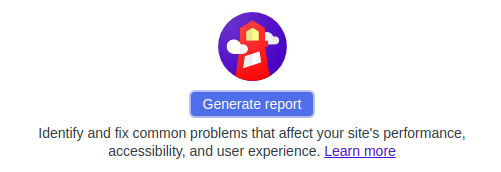

<a name="part0"></a>

## Настройка среды разработки для фреймворка Gatsby

Прежде чем приступить к созданию вашего первого сайта Gatsby, вам необходимо ознакомиться с некоторыми основными веб-технологиями и убедиться, что у вас установлены все необходимые программные средства.

1. [Установите Node.js](https://www.gatsbyjs.org/tutorial/part-zero/#install-nodejs-for-your-appropriate-operating-system) для вашей операционной системы. Node.js - это среда, которая может запускать код JavaScript вне веб-браузера. Gatsby построен с помощью Node.js. Чтобы начать работу с Gatsby, вам потребуется установить на компьютер его последнюю версию. В комплекте с Node.js поставляется npm таким образом, если у вас нет npm, скорее всего, у вас неустановлен Node.js. Прочитайте, [что такое npm](https://docs.npmjs.com/getting-started/what-is-npm).

2. [Установите Git](https://www.gatsbyjs.org/tutorial/part-zero/#install-git). Git - это бесплатная распределенная система управления версиями с открытым исходным кодом. Когда вы устанавливаете сайт “стартера " Gatsby, Gatsby использует git за кулисами, чтобы загрузить и установить необходимые файлы для вашего стартера. Вам нужно будет установить Git, чтобы настроить свой первый сайт на Gatsby. Ознакомьтесь с [руководством Git](https://guides.github.com/introduction/git-handbook/) на GitHub.

3. Установите интерфейс командной строки (CLI) Gatsby. Инструмент Gatsby CLI позволяет быстро создавать новые сайты с поддержкой Gatsby и запускать команды для разработки сайтов на Gatsby. Чтобы установить CLI Gatsby глобально выполните в терминале 

```
npm install -g gatsby-cli
```

### Создание сайта на Gatsby

Чтобы ускорить процесс создания определенного типа сайтов вы можете скачать "starters" (частично сделанные сайты с некоторой конфигурацией по умолчанию). Здесь вы будете использовать стартер ”Hello World", в котором есть самые необходимые элементы для создания сайта на Gatsby.

1. Откройте ваш терминал.

2. Выполните 

```
gatsby new hello-world https://github.com/gatsbyjs/gatsby-starter-hello-world
```
где,

* `new` - это команда Gatsby для создания нового проекта.

* `hello-world` - это произвольное название, вы можете выбрать что угодно. Инструмент CLI поместит код для вашего нового сайта в новую папку под названием “hello-world”.

* указанный URL - это адрес, указывющий на хранилище исходного кода на GitHub, который вы хотите использовать.

3. Выполните `cd hello-world`.

Команда `cd` (change directories), означает изменить рабочий каталог на "hello-world".

4. Выполните `gatsby develop`.

Эта команда запускает сервер разработки. Вы сможете видеть и взаимодействовать с вашим сайтом в локальной среде разработки, т. е. не в интернете, а на вашем компьютере.

### Просмотр вашего сайта локально

Откройте новую вкладку в браузере и перейдите на страницу http://localhost:8000/. Вы сможете посещать этот сайт до тех пор, пока работает ваш сервер разработки. Чтобы остановить этот процесс (другими словами “остановить запущенный сервер разработки”), вернитесь в окно терминала, удерживайте клавишу “control”, а затем нажмите “c” (ctrl-c). Чтобы начать все сначала, запустите приложение `gatsby develop` еще раз!

Примечание: Если вы используете установленный VM, например `vagrant`, и/или хотите прослушать локальный IP-адрес, запустите `gatsby develop --host=0.0.0.0`. Теперь сервер разработки слушает http://localhost и ваш локальный IP

### Настройка редактора кода

Редактор кода - это программа, разработанная специально для редактирования компьютерного кода.

Если вы решили использовать VS Code, посетите сайт [VS Code](https://code.visualstudio.com/#alt-downloads) и загрузите версию, соответствующую вашей платформе.

#### Установка плагина Prettier

Мы также рекомендуем использовать [Prettier](https://github.com/prettier/prettier), инструмент, который помогает форматировать код, во избежании многочисленно появляющихся при редактировании ошибок.

Вы можете использовать Prettier непосредственно в редакторе VS Code, используя плагин [Prettier VS Code](https://github.com/prettier/prettier-vscode):

1. Откройте меню View => Extensions в редакторе VS Code.
2. Найдите “Prettier - Code formatter”.
3. Нажмите кнопку "Install". (После установки вам будет предложено перезапустить VS Code, чтобы включить расширение. Новые версии VS Code будут автоматически активировать расширение после скачивания.)

Если вы не используете VS Code, ознакомьтесь с [инструкцией по установке Prettier](https://prettier.io/docs/en/install.html) или [интеграцией Prettier в другие редакторы](https://prettier.io/docs/en/editors.html).


<a name="part1"></a>

## 1. Знакомство со строительными блоками Gatsby 

В предыдущем разделе вы подготовили локальную среду разработки, установив необходимое программное обеспечение и создав свой первый сайт Gatsby с помощью [стартера “hello world”](https://github.com/gatsbyjs/gatsby-starter-hello-world). Теперь погрузитесь глубже в код, сгенерированный этим стартером.

### Использование стартеров Gatsby

В [нулевой части](#part0) учебника вы создали новый сайт на основе стартера "hello world", используя следующую команду:

```
gatsby new hello-world https://github.com/gatsbyjs/gatsby-starter-hello-world
```

При создании нового сайта на Gatsby можно использовать следующую структуру команд для создания нового сайта на основе любого существующего стартера Gatsby:

```
gatsby new [SITE_DIRECTORY_NAME] [URL_OF_STARTER_GITHUB_REPO]
```

Если вы опустите URL-адрес в конце, Gatsby автоматически создаст сайт для вас на основе стартера по умолчанию. Для этого раздела учебника придерживайтесь сайта ”Hello World", который вы уже создали в нулевой части учебника. Вы можете узнать больше об [изменении стартеров](https://www.gatsbyjs.org/docs/modifying-a-starter) в документации.

### Знакомство со страницами Gatsby

Откройте каталог `/src` в редакторе кода. Внутри находится один каталог: `/pages`.

Откройте файл по адресу `src/pages/index.js`. Код в этом файле создает компонент, который содержит один div и некоторый текст - соответственно, "Hello world!”

Gatsby использует горячую перезагрузку, чтобы ускорить процесс разработки. По сути, при запущенном сервере разработки Gatsby, каждый раз, когда вы сохраняете файл, файлы сайта Gatsby “просматриваются" в фоновом режиме и ваши изменения немедленно отображаются в браузере. Вам не нужно вручную обновлять страницу или перезапускать сервер разработки.

## Данные в Gatsby

В следующих четырех частях учебника (включая эту) вы погрузитесь в слой данных Gatsby, который является мощной функцией Gatsby, которая позволяет легко создавать сайты из Markdown, WordPress, headless CMSs и других источников данных всех вкусов.

Слой данных Gatsby работает на GraphQL. О GraphQL можно прочитать статью [Как использовать GraphQL](https://www.howtographql.com/).

Веб-сайт состоит из четырех частей: HTML, CSS, JS и данных. Давайте узнаем, как использовать данные на сайтах Гэтсби.

Что такое данные?

Очень компьютерный ответ был бы: данные - это такие вещи, как "строки", целые числа (42), объекты ({ pizza: true}) и т. д.

Для целей работы в Гэтсби, однако, более полезным ответом является “все, что живет вне компонента React".

До сих пор вы писали текст и добавляли изображения непосредственно в компоненты. Что является отличным способом для создания многих веб-сайтов. Но часто требуется хранить данные вне компонентов, а затем вносить их в компонент по мере необходимости.

Если вы создаете сайт с помощью WordPress (так что у других участников есть хороший интерфейс для добавления и поддержания контента) и Gatsby, данные для сайта (страницы и сообщения) находятся в WordPress, и вы по мере необходимости извлекаете эти данные в свои компоненты.

Данные также могут находиться в таких типах файлов, как Markdown, CSV и т. д. а также базы данных и API всех видов.

Слой данных Гэтсби позволяет извлекать данные из этих (и любых других источников) непосредственно в ваши компоненты — в нужной вам форме.

### Использование неструктурированных данных или GraphQL

Обязатеьно ли я использовать GraphQL и плагины source для извлечения данных на сайты Gatsby?

Необязательно! Вы можете использовать API `createPages` для извлечения неструктурированных данных на страницы Gatsby напрямую, а не через слой данных GraphQL. Это отличный выбор для небольших сайтов, в то время как GraphQL и исходные плагины могут помочь сэкономить время на более сложных сайтах.

Смотрите руководство [Using Gatsby without GraphQL](https://www.gatsbyjs.org/docs/using-gatsby-without-graphql/), чтобы узнать, как получить данные на ваш Gatsby сайт с помощью API node `createPages` и посмотреть пример сайта!

Когда использовать неструктурированные данные, а когда GraphQL?

Если вы создаете небольшой сайт, одним из эффективных способов его создания является извлечение неструктурированных данных, как описано в этом руководстве, с помощью API `createPages`, а затем, если сайт становится более сложным, вы переходите к созданию более сложных сайтов, или вы хотите преобразовать свои данные, выполните следующие действия:

1. Проверьте [Библиотеку плагинов](https://www.gatsbyjs.org/plugins/), чтобы узнать, существуют ли исходники плагинов и/или преобразованные плагины, которые вы хотите использовать

2. Если их нет, прочитайте руководство по разработке плагинов и подумайте о создании собственного!

### Как слой данных Gatsby использует GraphQL для извлечения данных в компоненты

Существует множество вариантов загрузки данных в компоненты React. Одной из самых популярных и мощных из них является технология [GraphQL](http://graphql.org/).

GraphQL был изобретен в Facebook, чтобы помочь инженерам продукта собрать необходимые данные в компоненты.

GraphQL - это язык запросов (QL-query language). Если вы знакомы с SQL, он работает очень похожим образом. Используя специальный синтаксис, вы описываете нужные данные в компоненте, а затем эти данные передаются вам.

Gatsby использует GraphQL, чтобы позволить компонентам объявлять необходимые им данные.

### Создание нового примера сайта

Создайте еще один новый сайт для этой части руководства. Вы собираетесь создать блог Markdown под названием "Панды едят много". Он посвящен демонстрации лучших фотографий и видео панд, поедающих много пищи. По пути вы будете погружать пальцы ног в GraphQL и поддержку Markdown от Gatsby.

Откройте новое окно терминала и выполните следующие команды, чтобы создать новый сайт Гэтсби в каталоге под названием `tutorial-part-four`. Затем перейдите в новый каталог:

```
gatsby new tutorial-part-four https://github.com/gatsbyjs/gatsby-starter-hello-world

cd tutorial-part-four
```

Затем установите некоторые другие необходимые зависимости в корне проекта. Вы будете использовать тему Typography "Kirkham", и вы попробуете библиотеку CSS-in-JS, ["Emotion”](https://emotion.sh/):

```
npm install --save gatsby-plugin-typography typography react-typography typography-theme-kirkham gatsby-plugin-emotion @emotion/core
```

Создайте сайт, подобный тому, что вы закончили в третьей части. Этот сайт будет иметь компонент макета и два компонента страницы:

src/components/layout.js

```jsx
import React from "react"
import { css } from "@emotion/core"
import { Link } from "gatsby"

import { rhythm } from "../utils/typography"

export default ({ children }) => (
  <div
    css={css`
      margin: 0 auto;
      max-width: 700px;
      padding: ${rhythm(2)};
      padding-top: ${rhythm(1.5)};
    `}
  >
    <Link to={`/`}>
      <h3
        css={css`
          margin-bottom: ${rhythm(2)};
          display: inline-block;
          font-style: normal;
        `}
      >
        Pandas Eating Lots
      </h3>
    </Link>
    <Link
      to={`/about/`}
      css={css`
        float: right;
      `}
    >
      About
    </Link>
    {children}
  </div>
)
```

src/pages/index.js

```jsx
import React from "react"
import Layout from "../components/layout"

export default () => (
  <Layout>
    <h1>Amazing Pandas Eating Things</h1>
    <div>
      
    </div>
  </Layout>
)
```

src/pages/about.js

```jsx
import React from "react"
import Layout from "../components/layout"

export default () => (
  <Layout>
    <h1>About Pandas Eating Lots</h1>
    <p>
      We're the only site running on your computer dedicated to showing the best
      photos and videos of pandas eating lots of food.
    </p>
  </Layout>
)
```

src/utils/typography.js

```jsx
import Typography from "typography"
import kirkhamTheme from "typography-theme-kirkham"

const typography = new Typography(kirkhamTheme)

export default typography
export const rhythm = typography.rhythm
```

gatsby-config.js

```jsx
module.exports = {
  plugins: [
    `gatsby-plugin-emotion`,
    {
      resolve: `gatsby-plugin-typography`,
      options: {
        pathToConfigModule: `src/utils/typography`,
      },
    },
  ],
}
```

Добавьте вышеуказанные файлы, а затем запустите команду `gatsby develop`, как обычно, и вы увидите следующее:


### Ваш первый запрос GraphQL 

При создании сайтов вы, вероятно, захотите повторно использовать общие части данных — например, название сайта. Посмотрите на страницу `/about/`. Вы заметите, что у вас есть название сайта (Панды много едят) как в компоненте макета (заголовок сайта), так и в тэге `<h1 />` страницы `about.js` (заголовок страницы).

Но что делать, если вы захотите изменить название сайта? Вам придется искать заголовок во всех ваших компонентах и редактировать каждый экземпляр. Это одновременно громоздко и подвержено ошибкам, особенно для больших и более сложных сайтов. Вместо этого вы можете хранить заголовок в одном месте и ссылаться на него из других файлов; измените заголовок в одном месте, и Gatsby извлечет ваш обновленный заголовок в файлы, которые ссылаются на него.

Местом для этих общих частей данных является объект `siteMetadata` в файле `gatsby-config.js`. Добавьте название вашего сайта в файл `gatsby-config.js`:

gatsby-config.js

```js
module.exports = {
  siteMetadata: {
    title: `Title from siteMetadata`,
  },
  plugins: [
    `gatsby-plugin-emotion`,
    {
      resolve: `gatsby-plugin-typography`,
      options: {
        pathToConfigModule: `src/utils/typography`,
      },
    },
  ],
}
```

Перезагрузите сервер разработки.

### Использование запроса страницы

Теперь название сайта доступно для запроса. Добавьте его в файл `about.js` используя [запрос страницы](https://www.gatsbyjs.org/docs/page-query):

src/pages/about.js

```jsx
import React from "react"
import { graphql } from "gatsby"
import Layout from "../components/layout"

export default ({ data }) => (
  <Layout>
    <h1>About {data.site.siteMetadata.title}</h1>
    <p>
      We're the only site running on your computer dedicated to showing the best
      photos and videos of pandas eating lots of food.
    </p>
  </Layout>
)

export const query = graphql`
  query {
    site {
      siteMetadata {
        title
      }
    }
  }
`
```

Сохраните файл и вы увидите следующее:

 

### Использование StaticQuery

[StaticQuery](https://www.gatsbyjs.org/docs/static-query/) - это новый API, добавленный в Gatsby v2, который позволяет безстраничным (non-page) компонентам (подобно компоненту layout.js) извлекать данные с помощью запросов GraphQL. Давайте использовать эту недавно введенную версию хука — [useStaticQuery](https://www.gatsbyjs.org/docs/use-static-query/).

Внесите некоторые изменения в файл src/components/layout.js для использования хука `useStaticQuery` и ссылки {data.site.siteMetadata.title}, которая использует эти данные. Когда вы закончите, ваш файл будет выглядеть следующим образом:

src/components/layout.js

```jsx
import React from "react"
import { css } from "@emotion/core"
import { useStaticQuery, Link, graphql } from "gatsby"

import { rhythm } from "../utils/typography"
export default ({ children }) => {
  const data = useStaticQuery(
    graphql`
      query {
        site {
          siteMetadata {
            title
          }
        }
      }
    `
  )
  return (
    <div
      css={css`
        margin: 0 auto;
        max-width: 700px;
        padding: ${rhythm(2)};
        padding-top: ${rhythm(1.5)};
      `}
    >
      <Link to={`/`}>
        <h3
          css={css`
            margin-bottom: ${rhythm(2)};
            display: inline-block;
            font-style: normal;
          `}
        >
          {data.site.siteMetadata.title}
        </h3>
      </Link>
      <Link
        to={`/about/`}
        css={css`
          float: right;
        `}
      >
        О сайте
      </Link>
      {children}
    </div>
  )
}
```

Зачем использовать здесь два разных запроса? Эти примеры были кратким введением в типы запросов, как они форматируются и где их можно использовать. А пока имейте в виду, что запросы к страницам могут делать только страницы. Нестраничные компоненты, такие как Layout, могут использовать StaticQuery. Часть 7 учебника объясняет их более подробно.

Один из основных принципов Gatsby заключается в том, что *создатели нуждаются в непосредственной связи с тем, что они создают* ([hat tip to Bret Victor](http://blog.ezyang.com/2012/02/transcript-of-inventing-on-principle/)). Другими словами, когда вы вносите какие-либо изменения в код, вы должны немедленно увидеть эффект этого изменения. Вы манипулируете входными данными Gatsby и видите на экране новый вывод.

## Плагины Source

Из этого туториала вы узнаете, как использовать GraphQL и плагины source для загрузки данных на сайт Gatsby. Однако прежде чем вы узнаете об этих плагинах, вы должны знать, как использовать инструмент GraphiQL, который поможет вам правильно структурировать ваши запросы.

### Введение в GraphiQL

GraphiQL - это интегрированная среда разработки (IDE) GraphQL. Это мощный инструмент, который вы будете часто использовать при создании веб-сайтов Гэтсби.

Вы можете получить к нему доступ, когда сервер разработки вашего сайта работает - обычно на http://localhost:8000/___graphql.

Просмотрите встроенный сайт “тип” и посмотрите, какие поля доступны на нем — включая объект siteMetadata, который вы запрашивали ранее. Попробуйте открыть GraphiQL и поиграть с вашими данными! Нажмите Ctrl + Space (или используйте Shift + Space в качестве альтернативного сочетания клавиш), чтобы открыть окно автозаполнения, и Ctrl + Enter, чтобы запустить запрос GraphQL. В оставшейся части урока вы будете использовать GraphiQL намного больше.

#### Использование обозревателя GraphiQL

Обозреватель GraphiQL позволяет интерактивно создавать полные запросы, щелкая по доступным полям и входным данным без повторяющегося процесса ввода этих запросов вручную.

Данные на сайты Gatsby могут поступать из любого места: API, баз данных, CMS, локальных файлов и т. д.

Плагины Source извлекают данные из своего источника. Например, source плагин filesystem знает, как извлечь данные из файловой системы. Плагин WordPress знает, как получить данные из API WordPress.

Добавьте `gatsby-source-filesystem` и изучите, как он работает.

Во-первых, установите плагин в корень проекта:

```
npm install --save gatsby-source-filesystem
```

Затем добавьте его в файл `gatsby-config.js`:

gatsby-config.js

```js
module.exports = {
  siteMetadata: {
    title: `Pandas Eating Lots`,
  },
  plugins: [
    {
      resolve: `gatsby-source-filesystem`,
      options: {
        name: `src`,
        path: `${__dirname}/src/`,
      },
    },
    `gatsby-plugin-emotion`,
    {
      resolve: `gatsby-plugin-typography`,
      options: {
        pathToConfigModule: `src/utils/typography`,
      },
    },
  ],
}
```

Сохраните это и перезагрузите сервер разработки gatsby. Затем снова откройте GraphiQL.

В области проводника вы увидите `allFile` и `file`, доступные как выбранные.

Щелкните раскрывающийся список allFile. Поместите курсор после allFile в область запроса, а затем введите Ctrl + Enter. Это позволит предварительно заполнить запрос на идентификатор каждого файла. Нажмите кнопку "Play", чтобы выполнить запрос.

На панели проводника поле id было выбрано автоматически. Сделайте выбор для большего количества полей, установив соответствующий флажок поля. Нажмите кнопку "Play", чтобы снова запустить запрос с новыми полями.

Кроме того, можно добавить поля с помощью сочетания клавиш автозаполнения (Ctrl + пробел). 

Попробуйте добавить несколько полей в запрос, нажимайте Ctrl + Enter каждый раз, чтобы повторно выполнить запрос. Вы увидите обновленные результаты запроса:

### Создание страницы с помощью запросов GraphQL 

Создание новых страниц с помощью Gatsby часто начинается в GraphiQL. Сначала вы набрасываете запрос данных, играя в GraphiQL, а затем копируете его в страницу компонента React, чтобы начать построение пользовательского интерфейса.

Создайте новый файл в `src/pages/my-files.js` с запросом GraphQL `allFile`, который вы только что создали:

src/pages/my-files.js

```jsx
import React from "react"
import { graphql } from "gatsby"
import Layout from "../components/layout"

export default ({ data }) => {
  console.log(data)
  return (
    <Layout>
      <div>Hello world</div>
    </Layout>
  )
}

export const query = graphql`
  query {
    allFile {
      edges {
        node {
          relativePath
          prettySize
          extension
          birthTime(fromNow: true)
        }
      }
    }
  }
`
```

Строка `console.log(data)` часто полезна при создании нового компонента для вывода данных, которые вы получаете из запроса GraphQL, чтобы вы могли исследовать данные в консоли браузера во время построения пользовательского интерфейса.

Если вы зайдете на новую страницу в `/my-files/` и откроете консоль браузера, вы увидите что-то вроде:

Форма данных совпадает с формой запроса GraphQL.

Добавьте некоторый код к компоненту, чтобы распечатать данные файла.

src/pages/my-files.js

```jsx
import React from "react"
import { graphql } from "gatsby"
import Layout from "../components/layout"

export default ({ data }) => {
  console.log(data)
  return (
    <Layout>
      <div>
        <h1>My Site's Files</h1>
        <table>
          <thead>
            <tr>
              <th>relativePath</th>
              <th>prettySize</th>
              <th>extension</th>
              <th>birthTime</th>
            </tr>
          </thead>
          <tbody>
            {data.allFile.edges.map(({ node }, index) => (
              <tr key={index}>
                <td>{node.relativePath}</td>
                <td>{node.prettySize}</td>
                <td>{node.extension}</td>
                <td>{node.birthTime}</td>
              </tr>
            ))}
          </tbody>
        </table>
      </div>
    </Layout>
  )
}

export const query = graphql`
  query {
    allFile {
      edges {
        node {
          relativePath
          prettySize
          extension
          birthTime(fromNow: true)
        }
      }
    }
  }
`
```

А теперь посетите `http://localhost:8000/my-files` …

Теперь вы узнали, как плагины source приносят данные в систему данных Gatsby. В следующем уроке вы узнаете, как плагины transformer преобразуют необработанный контент, который приносят Плагины source. Комбинация плагинов source и плагинов transformer может обрабатывать все источники данных и преобразования данных, которые могут потребоваться при создании сайта Gatsby. Узнайте о плагинах transformer в шестой части этого руководства.

## Плагины Transformer

В предыдущем уроке было показано, как плагины source доставляют данные в систему данных Gatsby. В этом уроке вы узнаете, как плагины transformer преобразуют исходное содержимое, полученное с помощью плагинов source. Комбинация плагинов source и плагинов transformer может обрабатывать все источники данных и преобразовывать данные, которые могут потребоваться при создании сайта на Gatsby.

Часто формат данных, которые вы получаете от source плагинов, не является тем, что вы хотите использовать для создания своего веб-сайта. Source плагин filesystem позволяет запрашивать данные о файлах, но что делать, если вы хотите запросить данные внутри файлов?

Чтобы сделать это возможным, Gatsby поддерживает плагины transformer, которые берут сырой контент из source плагинов и преобразуют его в нечто более полезное.

Возьмем, например, файлы markdown. В markdown удобно писать статьи, но когда вы создаете страницу с ним, вам нужно, чтобы markdown был преобразован в HTML.

Добавьте файл markdown на свой сайт по адресу src/pages/sweet-pandas-eating-sweets.md (это станет вашим первым markdown постом в блоге) и узнайте, как преобразовать его в HTML с помощью плагинов transformer и GraphQL.

src/pages/sweet-pandas-eating-sweets.md

```md
---
title: "Sweet Pandas Eating Sweets"
date: "2017-08-10"
---

Pandas are really sweet.

Here's a video of a panda eating sweets.

<iframe width="560" height="315" src="https://www.youtube.com/embed/4n0xNbfJLR8" frameborder="0" allowfullscreen></iframe>
```

Как только вы сохраните файл, посмотрите на `/my-files/` еще раз - новый файл markdown находится в таблице. Это очень сильная функция Gatsby. Как и в предыдущем примере `siteMetadata`, плагины source могут выполнять оперативную перезагрузку данных. `gatsby-source-filesystem` всегда ищет новые файлы, которые будут добавлены, и когда они появляются, повторно выполняет ваши запросы.

Добавьте плагин transformer, который может преобразовывать файлы markdown:

```
npm install --save gatsby-transformer-remark
```

Затем добавьте его в `gatsby-config.js`:

gatsby-config.js

```js
module.exports = {
  siteMetadata: {
    title: `Pandas Eating Lots`,
  },
  plugins: [
    {
      resolve: `gatsby-source-filesystem`,
      options: {
        name: `src`,
        path: `${__dirname}/src/`,
      },
    },
    `gatsby-transformer-remark`,
    `gatsby-plugin-emotion`,
    {
      resolve: `gatsby-plugin-typography`,
      options: {
        pathToConfigModule: `src/utils/typography`,
      },
    },
  ],
}
```

Перезагрузите сервер разработки, затем обновите (или откройте снова) GraphiQL и посмотрите на автозаполнение.

Снова выберите `allMarkdownRemark` и запустите его так же, как и для `allFile`. Вы увидите там файл markdown, который вы недавно добавили. Исследуйте поля, доступные на узле `MarkdownRemark`.

### Создание списка файлов markdown вашего сайта в src/pages/index.js

Теперь вам нужно будет создать список ваших файлов markdown на первой странице. Как и во многих блогах, вы хотите, чтобы в конечном итоге список ссылок на первой странице указывал на каждый пост в блоге. С помощью GraphQL вы можете запросить текущий список записей блога markdown, так что вам не нужно будет поддерживать список вручную.

Подобно странице `src/pages/my-files.js`, заменить `src/pages/index.js` со следующим, чтобы добавить запрос GraphQL с некоторым начальным HTML и стилем.

src/pages/index.js

```jsx
import React from "react"
import { graphql } from "gatsby"
import { css } from "@emotion/core"
import { rhythm } from "../utils/typography"
import Layout from "../components/layout"

export default ({ data }) => {
  console.log(data)
  return (
    <Layout>
      <div>
        <h1
          css={css`
            display: inline-block;
            border-bottom: 1px solid;
          `}
        >
          Amazing Pandas Eating Things
        </h1>
        <h4>{data.allMarkdownRemark.totalCount} Posts</h4>
        {data.allMarkdownRemark.edges.map(({ node }) => (
          <div key={node.id}>
            <h3
              css={css`
                margin-bottom: ${rhythm(1 / 4)};
              `}
            >
              {node.frontmatter.title}{" "}
              <span
                css={css`
                  color: #bbb;
                `}
              >
                — {node.frontmatter.date}
              </span>
            </h3>
            <p>{node.excerpt}</p>
          </div>
        ))}
      </div>
    </Layout>
  )
}

export const query = graphql`
  query {
    allMarkdownRemark {
      totalCount
      edges {
        node {
          id
          frontmatter {
            title
            date(formatString: "DD MMMM, YYYY")
          }
          excerpt
        }
      }
    }
  }
`
```

Теперь первая страница должна выглядеть так:


Но ваш единственный пост в блоге выглядит немного одиноким. Поэтому давайте добавим еще один в `src/pages/pandas-and-bananas.md`.

src/pages/pandas-and-bananas.md

```md
---
title: "Pandas and Bananas"
date: "2017-08-21"
---

Do Pandas eat bananas? Check out this short video that shows that yes! pandas do
seem to really enjoy bananas!

<iframe width="560" height="315" src="https://www.youtube.com/embed/4SZl1r2O_bY" frameborder="0" allowfullscreen></iframe>
```


Выглядит великолепно! Вот только ... порядок постов неправильный.

Но это легко исправить. При запросе соединения определенного типа вы можете передать в запрос GraphQL множество аргументов. Вы можете сортировать и фильтровать узлы, задавать количество узлов, которые нужно пропустить, и выбирать предел количества узлов, которые нужно извлечь. С помощью этого мощного набора операторов вы можете выбрать любые данные, которые вы хотите — в нужном вам формате.

В запросе GraphQL страницы индекса измените `allMarkdownRemark` на `allMarkdownRemark(sort: { fields: [frontmatter___date], order: DESC })`. Примечание: между frontmatter и date есть 3 подчеркивания. Сохраните это, и порядок сортировки должен быть установлен.

Попробуйте открыть GraphiQL и поиграть с различными вариантами сортировки. Вы можете сортировать соединение `allFile` вместе с другими соединениями.

Для получения дополнительной документации по наши операторы запросов, исследовать наш [справочник GraphQL](https://www.gatsbyjs.org/docs/graphql-reference/).

Это здорово! Вы только что создали красивую index страницу, где вы запрашиваете свои файлы markdown и создаете список заголовков и выдержек из записей в блоге. Но вы не хотите просто видеть выдержки, вам нужны реальные страницы для ваших файлов markdown.

Вы можете продолжать создавать страницы, помещая компоненты React в `src/pages`. Однако далее вы узнаете, как программно создавать страницы из данных. Gatsby не ограничивается созданием страниц из файлов, как многие статические генераторы сайтов. Gatsby позволяет использовать GraphQL для запроса данных и отображения результатов запроса на страницы — все во время сборки. Это действительно мощная идея. Вы изучите его последствия и способы использования в следующем учебнике, где вы узнаете, как [программно создавать страницы из данных](https://www.gatsbyjs.org/tutorial/part-seven/).


## Программное создание страниц из данных

В предыдущем руководстве вы создали красивую index страницу, которая запрашивает файлы markdown и создает список заголовков и выдержек из записей блога. Но вам нужны не  просто выдержки, а реальные страницы для ваших файлов markdown.

Вы можете продолжать создавать страницы, помещая компоненты React в `src/pages`. Однако теперь вы узнаете, как программно создавать страницы из данных. Gatsby не ограничивается созданием страниц из файлов, как многие статические генераторы сайтов. Gatsby позволяет использовать GraphQL для запроса данных и отображения результатов запроса на страницах — все во время сборки.

### Создание слагов для страниц

Чтобы создать новую страницу нужно выполнить два шага:

1. Создать "путь” или “слаг” для страницы.

2. Создать страницу.

слаг (slug) - понятный человеку фрагмент текста из URL в отличии от, например, ID, который может быть непонятным набором символом.

Примечание: часто источники данных напрямую предоставляют слаг или путь для содержимого - при работе с одной из этих систем (например, CMS), вам не нужно создавать слаги самостоятельно, как вы делаете с файлами markdown.

Для создания страниц markdown вы научитесь использовать два API-интерфейса Gatsby: `onCreateNode` и `createPages`. Это две рабочие лошадки API, которые вы увидите на многих сайтах и плагинах.

Мы делаем все возможное, чтобы сделать API Gatsby простыми в реализации. Для реализации API необходимо экспортировать функцию с именем API из `gatsby-node.js`.

В корне вашего сайта создайте файл с именем `gatsby-node.js`. Затем в него добавьте следующее.

```js
exports.onCreateNode = ({ node }) => {
  console.log(node.internal.type)
}
```

Эта функция `onCreateNode` будет вызываться Gatsby всякий раз, когда создается (или обновляется) новый узел.

Остановите и перезапустите сервер разработки. Как только вы это сделаете, вы увидите, что довольно много вновь созданных узлов войдут в консоль терминала.

В следующем разделе вы будете использовать этот API, чтобы добавлять слаги для ваших Markdown страниц `MarkdownRemark` узлов.

gatsby-node.js

```js
exports.onCreateNode = ({ node }) => {
  if (node.internal.type === `MarkdownRemark`) {
    console.log(node.internal.type)
  }
}
```

Вы хотите использовать каждое имя файла markdown для создания слага страницы. Так `pandas-and-bananas.md` станет `/pandas-and-bananas/`. Но как получить имя файла из узла `MarkdownRemark`? Чтобы получить его, вам нужно пересечь “узловой граф " к его родительскому узлу `File`, так как узлы `File` содержат необходимые вам данные о файлах на диске. Для этого снова измените свою функцию:

gatsby-node.js

```js
exports.onCreateNode = ({ node, getNode }) => {
  if (node.internal.type === `MarkdownRemark`) {
    const fileNode = getNode(node.parent)
    console.log(`\n`, fileNode.relativePath)
  }
}
```

После перезагрузки сервера разработки вы должны увидеть относительные пути для двух файлов markdown, напечатанных на экране терминала.

```
 pages/sweet-pandas-eating-sweets.md

 pages/pandas-and-bananas.md
```

Теперь вам придется создавать слаги. Поскольку логика создания слагов из имен файлов может быть сложной, плагин `gatsby-source-filesystem` поставляется с функцией для создания слагов. Давайте воспользуемся этим.

gatsby-node.js

```js
const { createFilePath } = require(`gatsby-source-filesystem`)

exports.onCreateNode = ({ node, getNode }) => {
  if (node.internal.type === `MarkdownRemark`) {
    console.log(createFilePath({ node, getNode, basePath: `pages` }))
  }
}
```

Функция обрабатывает поиск родительского узла `File` вместе с созданием слага. Запустите сервер разработки еще раз, и вы увидите, что в терминал вошли два слага, по одному для каждого файла markdown.

Теперь вы можете добавлять новые слаги непосредственно на узлы `MarkdownRemark`. Это очень важно, так как любые данные, которые вы добавляете в узлы, доступны для последующего запроса с помощью GraphQL. Так что, когда придет время создавать страницы, будет легко получить слаг.

Для этого вы будете использовать функцию, переданную в вашу реализацию API под названием `createNodeField`. Эта функция позволяет создавать дополнительные поля в узлах, созданных другими плагинами. Только первоначальный создатель узла может непосредственно модифицировать узел - все остальные плагины (включая ваш `gatsby-node.js`) должны использовать эту функцию для создания дополнительных полей.

gatsby-node.js

```js
const { createFilePath } = require(`gatsby-source-filesystem`)
exports.onCreateNode = ({ node, getNode, actions }) => {
  const { createNodeField } = actions
  if (node.internal.type === `MarkdownRemark`) {
    const slug = createFilePath({ node, getNode, basePath: `pages` })
    createNodeField({
      node,
      name: `slug`,
      value: slug,
    })
  }
}
```

Перезагрузите сервер разработки и откройте или обновите GraphiQL. Затем запустите этот запрос GraphQL, чтобы увидеть ваши новые слаги.

```graphql
{
  allMarkdownRemark {
    edges {
      node {
        fields {
          slug
        }
      }
    }
  }
}
```

Теперь, когда слаги созданы, вы можете создавать страницы.

### Создание страниц

В том же файле `gatsby-node.js`, добавьте следующее.

```js
const { createFilePath } = require(`gatsby-source-filesystem`)

exports.onCreateNode = ({ node, getNode, actions }) => {
  const { createNodeField } = actions
  if (node.internal.type === `MarkdownRemark`) {
    const slug = createFilePath({ node, getNode, basePath: `pages` })
    createNodeField({
      node,
      name: `slug`,
      value: slug,
    })
  }
}

exports.createPages = async ({ graphql, actions }) => {
  // **Note:** The graphql function call returns a Promise
  // see: https://developer.mozilla.org/en-US/docs/Web/JavaScript/Reference/Global_Objects/Promise for more info
  const result = await graphql(`
    query {
      allMarkdownRemark {
        edges {
          node {
            fields {
              slug
            }
          }
        }
      }
    }
  `)
  console.log(JSON.stringify(result, null, 4))
}
```

Вы добавили реализацию API `createPages`, который вызывает Gatsby, чтобы плагины могли добавлять страницы.

Как уже упоминалось во введении к этой части руководства, шагами по программному созданию страниц являются:

1. Запрос данных с помощью GraphQL

2. Отображение результатов запроса на страницах

Приведенный выше код является первым шагом для создания страниц из вашего markdown, поскольку вы используете предоставленную функцию `graphql` для запроса созданных вами слагов markdown. Затем вы выводите результат запроса, который должен выглядеть подобным образом:


Для создания страниц вам понадобится еще одна вещь помимо слага: компонент шаблона страницы. Как и все в Gatsby, программные страницы питаются компонентами React. При создании страницы необходимо указать, какой компонент использовать.

Создайте каталог в `src/templates`, а затем добавьте следующее в файл с именем `src/templates/blog-post.js`.

```jsx
import React from "react"
import Layout from "../components/layout"

export default () => {
  return (
    <Layout>
      <div>Hello blog post</div>
    </Layout>
  )
}
```

Затем измените gatsby-node.js

```js
const path = require(`path`)
const { createFilePath } = require(`gatsby-source-filesystem`)

exports.onCreateNode = ({ node, getNode, actions }) => {
  const { createNodeField } = actions
  if (node.internal.type === `MarkdownRemark`) {
    const slug = createFilePath({ node, getNode, basePath: `pages` })
    createNodeField({
      node,
      name: `slug`,
      value: slug,
    })
  }
}

exports.createPages = async ({ graphql, actions }) => {
  const { createPage } = actions
  const result = await graphql(`
    query {
      allMarkdownRemark {
        edges {
          node {
            fields {
              slug
            }
          }
        }
      }
    }
  `)

  result.data.allMarkdownRemark.edges.forEach(({ node }) => {
    createPage({
      path: node.fields.slug,
      component: path.resolve(`./src/templates/blog-post.js`),
      context: {
        // Data passed to context is available
        // in page queries as GraphQL variables.
        slug: node.fields.slug,
      },
    })
  })
}
```

Перезагрузите сервер разработки, и ваши страницы будут созданы! Простой способ найти новые страницы, которые вы создаете во время разработки, - это перейти на случайный путь, где Gatsby с удовольствием покажет вам список страниц на сайте. Если вы идете в http://localhost:8000/sdf, вы увидите новые страницы, которые вы создали.

Это немного скучно и не то, что вы хотите. Теперь вы можете получить данные из вашего поста markdown. Измените `src/templates/blog-post.js` следующим образом:

```jsx
import React from "react"
import { graphql } from "gatsby"
import Layout from "../components/layout"

export default ({ data }) => {
  const post = data.markdownRemark
  return (
    <Layout>
      <div>
        <h1>{post.frontmatter.title}</h1>
        <div dangerouslySetInnerHTML={{ __html: post.html }} />
      </div>
    </Layout>
  )
}

export const query = graphql`
  query($slug: String!) {
    markdownRemark(fields: { slug: { eq: $slug } }) {
      html
      frontmatter {
        title
      }
    }
  }
`
```

Последний шаг - это ссылка на ваши новые страницы с индексной страницы.

Вернитесь к `src/pages/index.js`, запросите ваши слаги markdown и создайте ссылки.

```jsx
import React from "react"
import { css } from "@emotion/core"
import { Link, graphql } from "gatsby"
import { rhythm } from "../utils/typography"
import Layout from "../components/layout"

export default ({ data }) => {
  return (
    <Layout>
      <div>
        <h1
          css={css`
            display: inline-block;
            border-bottom: 1px solid;
          `}
        >
          Amazing Pandas Eating Things
        </h1>
        <h4>{data.allMarkdownRemark.totalCount} Posts</h4>
        {data.allMarkdownRemark.edges.map(({ node }) => (
          <div key={node.id}>
            <Link
              to={node.fields.slug}
              css={css`
                text-decoration: none;
                color: inherit;
              `}
            >
              <h3
                css={css`
                  margin-bottom: ${rhythm(1 / 4)};
                `}
              >
                {node.frontmatter.title}{" "}
                <span
                  css={css`
                    color: #555;
                  `}
                >
                  — {node.frontmatter.date}
                </span>
              </h3>
              <p>{node.excerpt}</p>
            </Link>
          </div>
        ))}
      </div>
    </Layout>
  )
}

export const query = graphql`
  query {
    allMarkdownRemark(sort: { fields: [frontmatter___date], order: DESC }) {
      totalCount
      edges {
        node {
          id
          frontmatter {
            title
            date(formatString: "DD MMMM, YYYY")
          }
          fields {
            slug
          }
          excerpt
        }
      }
    }
  }
`
```

В этой части урока вы изучили основы построения с помощью слоя данных Gatsby. Вы узнали, как создавать и преобразовывать данные с помощью плагинов, как использовать GraphQL для отображения данных на страницы, а затем как создавать компоненты шаблонов страниц, в которых запрашиваются данные для каждой страницы.


* Вы можете взглянуть на некоторые [примеры сайтов](https://github.com/gatsbyjs/gatsby/tree/master/examples#gatsby-example-websites)

* Узнать больше [о плагинах](https://www.gatsbyjs.org/docs/plugins/)

* Посмотрите, что [другие люди строят создают с помощью Гэтсби](https://www.gatsbyjs.org/showcase/)

* Ознакомьтесь с документацией по [Gatsby’s APIs](https://www.gatsbyjs.org/docs/api-specification/), [nodes](https://www.gatsbyjs.org/docs/node-interface/), или [GraphQL](https://www.gatsbyjs.org/docs/graphql-reference/)


## Подготовка сайта к публикации

Ты уже научился следующему:

* создание новых сайтов Gatsby

* создание страниц и компонентов

* компоненты стиля

* добавление плагинов на сайт

* данные source и transform

* использование GraphQL для запроса данных для страниц

* программное создание страниц из ваших данных

В этом заключительном разделе вы пройдете через некоторые общие шаги по подготовке сайта к работе, представив мощный инструмент диагностики сайта под названием [Lighthouse](https://developers.google.com/web/tools/lighthouse/). Попутно мы представим еще несколько плагинов, которые вы часто будете использовать на своих сайтах Gatsby.

### Аудит с помощью  Lighthouse

Цитата с [сайта Lighthouse](https://developers.google.com/web/tools/lighthouse/):

> Lighthouse - это автоматизированный инструмент с открытым исходным кодом для улучшения качества веб-страниц. Вы можете запустить его на любой веб-странице, общедоступной или требующей аутентификации. Он имеет аудиты производительности, доступности, прогрессивных веб-приложений (PWA), и многое другое.

Lighthouse включен в инструменты разработчика Chrome. Проведение аудита, а затем устранение обнаруженных ошибок и внедрение предложенных улучшений — отличный способ подготовить ваш сайт к работе. Это дает вам уверенность в том, что ваш сайт будет максимально быстрым и доступным.

Попробуйте это!

Во-первых, вам нужно создать продакшен сборку вашего сайта Gatsby. Сервер разработки Gatsby оптимизирован для ускорения разработки; но сайт, который он создает, хотя и очень похож на рабочую версию сайта, не так оптимизирован.

### Создание продакшен сборки

1. Остановите сервер разработки (если он все еще работает) и выполните следующую команду:

```shell
gatsby build
```

Как вы узнали в [части 1](#part1), эта команда делает продакшен сборку вашего сайта и выводит встроенные статические файлы в каталог `public`.

2. Просмотрите продакшен сайт локально. Выполните:

```shell
gatsby serve
```

После ввода этой команды, вы можете просмотреть свой сайт по адресу http://localhost:9000.

### Выполнение аудита с помощью Lighthouse

Теперь вы проведете свой первый тест на Lighthouse.

1. Если вы еще не сделали этого, откройте сайт в Chrome Incognito Mode, чтобы никакие расширения не мешали тесту. Затем, откройте Chrome DevTools.

2. Нажмите на вкладку "Audits", где вы увидите экран, который выглядит следующим образом:



3. Нажмите кнопку "Generate report" (по умолчанию должны быть выбраны все доступные типы аудита). Затем потребуется минута или около того, чтобы выполнить аудит. После завершения аудита вы должны увидеть результаты, которые выглядят следующим образом:

Как вы можете видеть, производительность Gatsby превосходна из коробки, но вам не хватает некоторых вещей для PWA, Accessibility, Best Practices и SEO, которые улучшат ваши результаты (и в процессе сделают ваш сайт намного более дружелюбным для посетителей и поисковых систем).

### Добавление файла манифеста

Похоже, у вас довольно тусклая оценка в категории “Progressive Web App”. Давайте разберемся с этим.

Но во-первых, что такое PWA?

Это обычные веб-сайты, которые используют преимущества современных функций браузера, чтобы улучшить работу веб с помощью особенностей и эффектов, подобных приложениям. Ознакомьтесь с [обзором в Google](https://developers.google.com/web/progressive-web-apps/) о том, что определяет PWA.

Включение манифеста веб-приложения является одним из трех общепринятых [базовых требований для PWA](https://alistapart.com/article/yes-that-web-project-should-be-a-pwa#section1).

Цитирование [Google](https://developers.google.com/web/fundamentals/web-app-manifest/):

> Манифест веб-приложения - это простой JSON-файл, который сообщает браузеру о вашем веб-приложении и о том, как оно должно вести себя при "установке" на мобильном устройстве или рабочем столе пользователя.

[Плагин манифеста Gatsby](https://www.gatsbyjs.org/packages/gatsby-plugin-manifest/) настраивает Gatsby для создания файла `manifest.webmanifest` для каждой сборки сайта.

### Использование gatsby-plugin-manifest

1. Установите плагин:

```shell
npm install --save gatsby-plugin-manifest
```

2. Добавьте favicon для вашего приложения в разделе `src/images/icon.png`. Для целей этого урока вы можете использовать [этот значок](https://raw.githubusercontent.com/gatsbyjs/gatsby/master/docs/tutorial/part-eight/icon.png), если у вас его нет. Икона необходима для построения всех образов для манифеста. Для получения дополнительной информации обратитесь к документации по `gatsby-plugin-manifest`.

3. Добавьте плагин к массиву `plugins` в вашем файле `gatsby-config.js`.

```js
{
  plugins: [
    {
      resolve: `gatsby-plugin-manifest`,
      options: {
        name: `GatsbyJS`,
        short_name: `GatsbyJS`,
        start_url: `/`,
        background_color: `#6b37bf`,
        theme_color: `#6b37bf`,
        // Enables "Add to Homescreen" prompt and disables browser UI (including back button)
        // see https://developers.google.com/web/fundamentals/web-app-manifest/#display
        display: `standalone`,
        icon: `src/images/icon.png`, // This path is relative to the root of the site.
      },
    },
  ]
}
```

Это все, что вам нужно, чтобы начать работу с добавлением веб-манифеста на сайт Gatsby. Приведенный пример отражает базовую конфигурацию - Проверьте [ссылку на плагин](https://www.gatsbyjs.org/packages/gatsby-plugin-manifest/?=gatsby-plugin-manifest#automatic-mode) для получения дополнительных опций.

### Добавление офлайн поддержки

Еще одно требование к веб-сайту, чтобы квалифицироваться как PWA, - это использование [Service Worker](https://developer.mozilla.org/en-US/docs/Web/API/Service_Worker_API). Service Worker работает в фоновом режиме, решая обслуживать сетевое или кэшированное содержимое на основе подключения, что обеспечивает бесперебойную управляемую автономную работу.

[Офлайн плагин Gatsby](https://www.gatsbyjs.org/packages/gatsby-plugin-offline/) делает сайт Gatsby автономным и более устойчивым к плохим сетевым условиям, создавая Service Worker для вашего сайта.

### Использование gatsby-plugin-offline

1. Установите плагин:

```shell
npm install --save gatsby-plugin-offline
```

Добавьте плагин к массиву `plugins` в вашем файле `gatsby-config.js`.

```js
{
  plugins: [
    {
      resolve: `gatsby-plugin-manifest`,
      options: {
        name: `GatsbyJS`,
        short_name: `GatsbyJS`,
        start_url: `/`,
        background_color: `#6b37bf`,
        theme_color: `#6b37bf`,
        // Enables "Add to Homescreen" prompt and disables browser UI (including back button)
        // see https://developers.google.com/web/fundamentals/web-app-manifest/#display
        display: `standalone`,
        icon: `src/images/icon.png`, // This path is relative to the root of the site.
      },
    },
    `gatsby-plugin-offline`,
  ]
}
```

Это все, что вам нужно, чтобы начать работу с Service Worker с помощью Gatsby.

Офлайн плагин должен быть указан после плагина манифеста, чтобы офлайн плагин мог кэшировать созданный `manifest.webmanifest`.

### Добавление метаданных страницы

Добавление метаданных на страницы (таких как заголовок или описание) является ключевым фактором, помогающим поисковым системам, таким как Google, понять ваш контент и решить, когда его следует отображать в результатах поиска.

[React Helmet](https://github.com/nfl/react-helmet) - это пакет, который содержит интерфейс React компонента, чтобы управлять [заголовком документа](https://developer.mozilla.org/en-US/docs/Web/HTML/Element/head).

Gatsby обеспечивает поддержку [плагина react helmet](https://www.gatsbyjs.org/packages/gatsby-plugin-react-helmet/) для отображения данных сервера, добавленных с помощью React Helmet. С помощью плагина атрибуты, которые вы добавляете в React Helmet, будут добавлены к статическим HTML-страницам, которые создает Гэтсби.