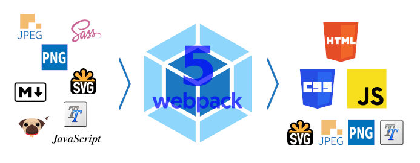
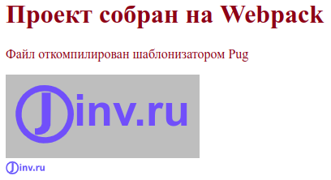
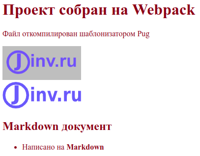
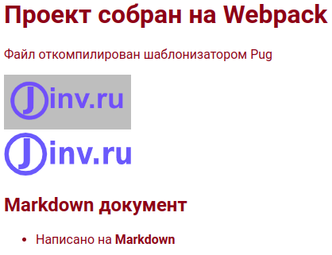
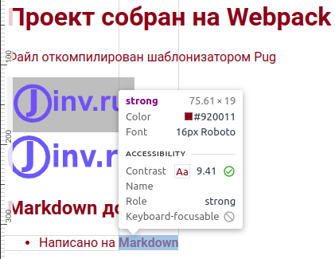
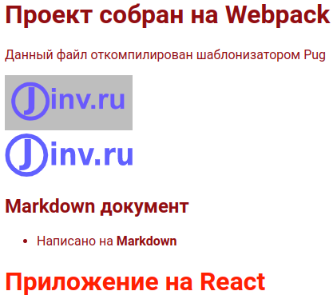

## О чем статья

Эта статья является подробной инструкцией по настройке сборщика Webpack 5 с нуля. Здесь будут, по возможности, объясняться все непонятные моменты в настройках - не только "что делать", но и "зачем это надо".

После выполнения всех шагов в этом руководстве у вас будет рабочий шаблон, с помощью которого можно разрабатывать фронтенд сайта и использовать для этого следующие инструменты: Pug, Sass, JavaScript, React и Markdown.



- Шаблонизатор Pug используется для разметки, которая будет автоматически преобразовываться в разметку HTML.

- Препроцессор Sass применяется для стилей, которые будут автоматически преобразовываться в стили CSS.

- Язык JavaScript необходим для создания интерактивности сайта, при этом, сборка позволит использовать последние достижения языка и не переживать, что новую функцию не распознает старый браузер.

- React - JavaScript-библиотека для создания пользовательских интерфейсов

- Разметка Markdown позволяет более легко наполнять текстовой информацией страницы сайта. Разметка Markdown преобразуется в понятный для браузеров HTML.

Освоив необходимый минимум можно без труда доработать созданный шаблон для чего угодно, например, интегрировать TypeScript.

## Быстрый запуск Webpack

Чтобы выполнять дальнейшие действия, установите на компьютер [Node.js](https://nodejs.org/).

Дальнейшие действия автором статьи выполнялись в операционной системе Ubuntu 20.04, в которой установлена среда NodeJS v16.17.1 и менеджер пакетов NPM v8.15.0, использовался стандартный Терминал, стандартный Текстовый редактор (далее по тексту будет называться редактор кода или редактор) и браузер FireFox v105.0. Здесь показано, какие инструменты использовал автор, у вас инструменты могут отличаться.

Откроем терминал и создадим каталог будущего проекта:

```bash
mkdir my-project
```

Сделаем этот каталог рабочим:

```bash
cd my-project
```

Обратите внимание! С этого момента старайтесь не закрывать окно терминала, так как в нем открыт рабочий каталог проекта `my-project` и все дальнейшие команды в терминале выполняются в корневом каталоге проекта. Если же терминал был закрыт, то откройте новый терминал и выполните команду: `cd my-project`.

Теперь, если нужна [система контроля версий Git](https://git-scm.com/), выполним два шага. Сначала в открытом терминале инициализируем Git:

```bash
git init
```

В корне проекта создается скрытый каталог `.git`, в котором хранятся необходимые файлы git-репозитория. Чтобы в файловом менеджере увидеть каталог `.git` нажмем комбинацию клавиш `Ctrl+H`.

Затем, в корне проекта создадим скрытый файл `.gitignore`. Для этого, в открытом терминале введем следующее:

```bash
touch .gitignore
```

В этом файле будем указывать имена и шаблоны для файлов и каталогов, которые не нужны в репозитории. С помощью редактора откроем файл `.gitignore` и запишем следующее:

```bash
node_modules
```

Эта запись указывает системе Git - игнорировать каталог `node_modules`, не отслеживать и не добавлять каталог в репозиторий.

> Не забывайте сохранять в редакторе всё, что изменили. Это забывают делать не только новички, но и опытные разработчики. Так что, если после очередной правки в редакторе, у вас что-то не работает, обязательно убедитесь, что код сохранен. В дальнейшем я не буду напоминать об этом. Запомни правило: сделал правку в редакторе, нажми сочетание клавиш `Ctrl+S`. Это сочетание сохраняет изменения и работает практически в любом редакторе.

С настройками Git в этом проекте закончим. Теперь, не забываем, иногда, а лучше, почаще, делать коммиты.

Теперь, инициализируем npm, для этого в терминале введем команду:

```bash
npm init -y
```

В корне проекта создается файл `package.json` с настройками по умолчанию, на что указывает опция `-y`. Подробно о файле `package.json` читайте в [документации по npm](https://docs.npmjs.com/cli/v8/configuring-npm/package-json).

Теперь установим `webpack` и `webpack-cli`, который используется для запуска webpack в командной строке. Для этого, в открытом терминале введем следующее:

```bash
npm i -D webpack webpack-cli
```

`i` - это сокращение от `install`. Опция `-D` указывает, что установленные пакеты нужны только для режима `development` и не будут использоваться в производственной сборке. В файле `package.json` эти пакеты указываются в секции `"devDependencies": {...}`.

В результате выполнения команды, создается каталог `node_modules` и файл `package-lock.json`. Каталог `node_modules` содержит зависимости проекта. Этот каталог не рекомендуется включать в репозиторий, что и указали раньше в файле `.gitignore`. Файл `package-lock.json` хранит записи о точных версиях установленных зависимостей.

Теперь в корне проекта создадим каталог, в котором будет хранится исходный код. Для этого с помощью открытого терминала создадим каталог `src`:

```bash
mkdir src
```

В каталоге `src` создадим файл `index.js`:

```bash
touch src/index.js
```

В редакторе откроем файл `src/index.js` и введем следующий код:

```js
function component(text) {
  const element = document.createElement('h1');
  element.textContent = text;
  return element;
}

document.body.prepend(component('Проект собран на Webpack'));
```

Затем в редакторе откроем `package.json` и добавим в поле `"scripts"` следующую строку с `dev`:

```json
"scripts": {
  "dev": "webpack --mode development",
  "test": "echo \"Error: no test specified\" && exit 1"
}
```

`dev` - это произвольное сокращенное имя для команды `webpack --mode development`. Подобные скрипты в секции `"scripts"` файла `package.json` запускаются в с помощью команды `npm run`. Так, для запуска скрипта выше, введем в терминале следующую команду:

```bash
npm run dev
```

В результате, в корне проекта появится каталог `dist`, в который скомпилируется файл `main.js`. Если сравнить содержимое файла `main.js` с исходным `src/index.js`, то увидим отличия, хотя они выполняют одно и то же. Итак, мы запустили webpack в режиме разработки и выполнили сборку проекта. Пока только сборка состояла в простой компиляции файла `src/index.js` в файл `dist/main.js`.

Команда `npm run dev` запустит webpack в режиме `development`. Перед началом выполнения, webpack будет искать в корне проекта файл настроек `webpack.config.js`. Так как, файл мы еще не создали, то webpack применяет настройки по умолчанию. Webpack определит точку входа `src/index.js` и выведет откомпилированный код в файл `dist/main.js`. Подробно об изменении настроек смотри в статье [Настройка в webpack точки входа и выхода](#настройка-в-webpack-точки-входа-и-выхода).

Теперь создадим HTML файл, который будет загружать скрипт `main.js`. Для этого, в терминале выполним:

```bash
touch dist/index.html
```

Затем откроем файл `dist/index.html` в редакторе и запишем следующее:

```html
<!DOCTYPE html>
<html>
  <head>
    <meta charset="utf-8" />
    <title>Быстрый запуск Webpack</title>
  </head>
  <body>
    <p>Файл создан вручную</p>
    <script src="main.js"></script>
  </body>
</html>
```

Файловая структура нашего проекта выглядит так:

```Plain text
my-project
  |-dist
    index.html
    main.js
  |+node_modules
  |-src
    index.js
  |+.git
  package-lock.json
  package.json
  .gitignore
```

Файл `dist/index.html` откроем в браузере и увидим следующее:

```Plain text
Проект собран на Webpack
Файл создан вручную
```

## Установка и настройка html-webpack-plugin

В примере выше, файл `index.html` добавляется вручную. Теперь, настроим webpack, чтобы HTML-файл автоматически создавался в готовой сборке из исходного шаблона. Для этого используем плагин `html-webpack-plugin`.

Из терминала установим плагин:

```bash
npm i -D html-webpack-plugin
```

Теперь настроим html-webpack-plugin в файле `webpack.config.js`. Но сначала создадим этот файл в корне проекта. Для этого в терминале выполним:

```bash
touch webpack.config.js
```

Затем откроем файл webpack.config.js в редакторе и вставим следующий код:

```js
const HtmlWebpackPlugin = require('html-webpack-plugin');
const path = require('path');

module.exports = {
  plugins: [
    new HtmlWebpackPlugin({
      template: path.join(__dirname, 'src', 'template.html'),
      filename: 'index.html',
    }),
  ],
};
```

Для файла `webpack.config.js` разберем содержимое:

- Первые две строки импортируют модули `html-webpack-plugin` и `path` и определяют эти модули в переменные `HtmlWebpackPlugin` и `path` соответственно.

- `module.exports = {}` - эта запись означает, что все настройки файла `webpack.config.js` помещаются в объект, который экспортируется как модуль по умолчанию.

- Для плагина `html-webpack-plugin` создается экземпляр `new HtmlWebpackPlugin` с двумя заданными свойствами: `template` - путь к входному файлу и `filename` - имя выходного файла.

В свойстве `template` разберем путь, который, на первый взгляд, сложен для понимания.

В Linux и macOS пути выглядят так: `/path/to/template.html`. В Windows пути выглядят иначе: `C:\path\to\template.html`. В Node.js существует модуль `path`, который учитывает эти различия. Модуль `path` мы подключили во второй строке файла `webpack.config.js`, а затем вызвали в свойстве `template`. Метод [path.join](https://nodejs.org/dist/latest-v16.x/docs/api/path.html#pathjoinpaths) объединяет заданные сегменты пути вместе и использует необходимый разделитель для конкретной системы. Сегменты пути для метода `path.join` мы задали тремя аргументами `__dirname`, `'src'` и `'template.html'`. Если заранее известно, что этот шаблон будет использоваться в ОС Linux, то можно вместо такого кода `template: path.join(__dirname, 'src', 'template.html')` указать проще - `template: './src/template.html'`

- `__dirname` - глобальная константа, которая указывает абсолютный путь к каталогу файла, код которого запрашивает эту константу, т. е. в нашем случае, файл, который запрашивает `__dirname` - это файл webpack.config.js, поэтому `__dirname` содержит абсолютный путь к корневому каталогу проекта.

Вместо метода `path.join` часто применяют метод [path.resolve](https://nodejs.org/dist/latest-v16.x/docs/api/path.html#pathresolvepaths).

Файл настроек [webpack.config.js](https://webpack.js.org/configuration/#options) нужен вебпаку, чтобы знать, какие плагины и с какими настройками использовать в том или ином случае. Если файл настроек лежит в корне проекта и называется `webpack.config.js`, то webpack автоматически его определит. Если же имя или расположение файла настроек иное, то нужно в файле `package.json` указать это с помощью опции `--config`, например:

```json
"scripts": {
  "serve": "webpack serve --open --mode development --config dev/serve.config.js"
}
```

Однако, это мы вносить в файл не будем.

Из терминала создадим файл `src/template.html`:

```bash
touch src/template.html
```

Откроем в редакторе файл `src/template.html` и скопируем такую разметку:

```html
<!DOCTYPE html>
<html>
  <head>
    <meta charset="utf-8" />
    <title>Быстрый запуск Webpack</title>
  </head>
  <body>
    <p>Файл создан плагином html-webpack-plugin</p>
  </body>
</html>
```

Теперь, удалим каталог `dist` с двумя файлами, а после в терминале запустим команду:

```bash
npm run dev
```

Каталог `dist` снова создан, а внутри него созданы файлы `index.html` и `main.js`. Если откроем с помощью браузера файл `dist/index.html`, то увидим:

```Plain text
Проект собран на Webpack
Файл создан плагином html-webpack-plugin
```

Таким образом, плагин html-webpack-plugin сделал две вещи:

- создал файл `dist/index.html` из файла `src/template.html`
- в файле `dist/index.html` автоматически прописал путь к файлу скрипта main.js.

Минимально возможный вариант сборки webpack собран и настроен. С помощью этого шаблона можно начинать разработку проекта по следующему алгоритму:

1. Редактируем исходный код в файлах каталога `src`
2. Сохраняем результат
3. Выполняем сборку проекта с помощью команды:

```bash
npm run dev
```

4. Открываем в браузере файл `dist/index.html`, либо если этот файл открытый, перезагружаем страницу браузера.
5. Смотрим на полученный результат в браузере и если надо, повторяем шаги сначала.

## Установка и настройка DevServer

При разработке проекта нужно каждый раз запускать в терминале команду `npm run dev` и вручную обновлять страницу браузера. Для уменьшения количества рутинных операций, автоматизируем процесс.

В webpack доступно три способа, которые позволяют при сохранении кода автоматически его компилировать:

1. [Режим Watch](https://webpack.js.org/guides/development/#using-watch-mode)
2. [webpack-dev-server](https://webpack.js.org/guides/development/#using-webpack-dev-server)
3. [webpack-dev-middleware](https://webpack.js.org/guides/development/#using-webpack-dev-middleware)

Здесь рассмотрим вариант с веб сервером. С помощью терминала установим webpack-dev-server:

```bash
npm i -D webpack-dev-server
```

В редакторе откроем файл `webpack.config.js` и добавим настройки для веб-сервера (указано знаками `+`):

```js
  const HtmlWebpackPlugin = require('html-webpack-plugin');
  const path = require('path');

  module.exports = {
    plugins: [
      new HtmlWebpackPlugin({
        template: path.join(__dirname, 'src', 'template.html'),
        filename: 'index.html',
      }),
    ],
+   devServer: {
+     watchFiles: path.join(__dirname, 'src'),
+     port: 9000,
+   },
  };
```

Для `devServer` указали два свойства:

- `watchFiles` указывает на каталог `src`, за которыми будет вестись наблюдение и в случае, если в каталоге произойдут изменения, веб сервер автоматически перезапустит сборку проекта и перезагрузит страницу браузера.
- `port` указывает порт на котором будет работать веб-сервер, по умолчанию - localhost:8080.

Чтобы запускать веб сервер короткой командой создадим для CLI скрипт "serve" в файле `package.json`:

```json
{
  "scripts": {
+   "serve": "webpack serve --open --mode development",
    "dev": "webpack --mode development",
    "test": "echo \"Error: no test specified\" && exit 1"
  }
}
```

- `serve` означает запустить веб сервер.
- [`--open`](https://webpack.js.org/configuration/dev-server/#devserveropen) автоматически запускает браузер.
- `--mode development` включает режим разработки.

Перед тем как запустить веб-сервер удалим каталог `dist`. Это делать необязательно, а нужно для понимания работы веб-сервера.

В терминале запустим веб-сервер командой:

```bash
npm run serve
```

В результате, автоматически откроется страница браузера по адресу http://localhost:9000/ и мы увидим тоже, что и в прошлый раз:

```Plain text
Проект собран на Webpack
Файл создан плагином html-webpack-plugin
```

Если по какой-то причине, страница браузера автоматически не откроется, то откройте браузер вручную и перейдите по адресу http://localhost:9000

В проекте отсутствует каталог `dist`. Тогда откуда браузер берет данные? DevServer компилирует исходный код, и записывает файлы в оперативную память.

Теперь файловая структура нашего проекта будет выглядеть так:

```Plain text
my-project
  |-node_modules
  |-src
    index.js
    template.html
  |+.git
  package-lock.json
  package.json
  webpack.config.js
  .gitignore
```

Веб-сервер можно остановить, если в терминале нажать сочетание клавиш Ctrl+C.

## Настройка в Webpack точки входа и выхода

В Webpack'е с четвертой версии не требуется задавать точки входа и выхода, а допускается использовать настройки по умолчанию:

- точка входа - `./src/index.js`
- точка выхода - `./dest/main.js`.

Это упрощает настройки, когда проект несложный, но если проект расширяет функциональность, то без настроек точек входа и выхода не обойтись.

### Точка входа

**Точка входа** - файл, который Webpack компилирует первым и если в этом файле подключаются зависимости, то эти зависимости тоже обрабатываются.

С помощью настроек, укажем, использовать точку входа. Для этого в файл `webpack.config.js` добавим свойство `entry`:

```js
module.exports = {
  entry: path.join(__dirname, 'src', 'index.js'),
};
```

Теперь, чтобы изменить точку входа изменяем значение свойства `entry`. Также, можно задать несколько точек входа. Это нужно при [разделении кода](https://webpack.js.org/guides/code-splitting/) на части. Подробно о настройках точки входа читайте в статьях [Entry Points](https://webpack.js.org/concepts/entry-points/) и [Entry and Context](https://webpack.js.org/configuration/entry-context/).

### Точка выхода

**Точка выхода** - каталог, в который Webpack компилирует точки входа.

Точка выхода настраивается в файле `webpack.config.js` с помощью свойства `output`:

```js
module.exports = {
  output: {
    path: path.join(__dirname, 'dist'),
    filename: 'index.[contenthash].js',
  },
};
```

где:

- `[contenthash]` - шаблон, в который подставляется хеш, сгенерированный на основе содержимого файла. Хеширование меняет имя после каждого изменения содержимого файла. Это решает проблему версионирования. Если хеш изменился, то браузер берет не старый файл из кеша, а загружает новый с сервера. 20 знаков хеша сократить до нужного количества символов можно следующим образом: [contenthash:8]. Хеш будет длиной 8 символов. Подробно о шаблоне хешей читайте в статье [Hash vs chunkhash vs ContentHash](https://medium.com/@sahilkkrazy/hash-vs-chunkhash-vs-contenthash-e94d38a32208).

Подробно о точках выхода описывается в статьях [concepts/output](https://webpack.js.org/concepts/output/) и [configuration/output](https://webpack.js.org/configuration/output/).

Теперь файл `webpack.config.js` выглядит так:

```js
const HtmlWebpackPlugin = require('html-webpack-plugin');
const path = require('path');

module.exports = {
  entry: path.join(__dirname, 'src', 'index.js'),
  output: {
    path: path.join(__dirname, 'dist'),
    filename: 'index.[contenthash].js',
  },
  plugins: [
    new HtmlWebpackPlugin({
      template: path.join(__dirname, 'src', 'template.html'),
      filename: 'index.html',
    }),
  ],
  devServer: {
    watchFiles: path.join(__dirname, 'src'),
    port: 9000,
  },
};
```

В терминале нажмем `Ctrl+C` и остановим сервер, а затем запустим следующую команду:

```bash
npm run dev
```

В корне проекта появится каталог `dist`, в котором будут два файла: `index.html` и `index.[hash].js`. Второй файл раньше назывался `main.js`. Код в имени файла - хеш, который будет меняться с изменением содержимого файла.

## Автоматическая очистка каталогов

Перед каждым запуском вебпака полезно очищать каталог dist. Это предотвратит накапливание ненужных файлов. Для этого применим [filemanager-webpack-plugin](https://github.com/gregnb/filemanager-webpack-plugin).

Для начала, установим filemanager-webpack-plugin:

```bash
npm i -D filemanager-webpack-plugin
```

Затем, в файле webpack.config.js добавим:

```js
  const HtmlWebpackPlugin = require('html-webpack-plugin');
  const path = require('path');
+ const FileManagerPlugin = require('filemanager-webpack-plugin');

  module.exports = {
    ...
    plugins: [
      new HtmlWebpackPlugin({
        ...
      }),
+     new FileManagerPlugin({
+       events: {
+         onStart: {
+           delete: ['dist'],
+         },
+       },
+     }),
    ],
    devServer: {
      ...
    },
  };
```

Каталог `dist`, если быть точным, не очищается, а удаляется. Плагин `filemanager-webpack-plugin` может также копировать, создавать, перемещать, архивировать файлы и каталоги перед началом сборки `onStart` и по окончании `onEnd`. В дальнейшем, воспользуемся плагином для копирования файлов.

Проверим работу пакета `filemanager-webpack-plugin`, для этого в терминале запустим веб-сервер командой:

```bash
npm run serve
```

В результате, автоматически откроется страница браузера по адресу http://localhost:9000/ и мы увидим тоже, что и в прошлый раз:

```Plain text
Проект собран на Webpack
Файл создан плагином html-webpack-plugin
```

Если же проверим корневой каталог проекта, то не увидим каталога `dist`, что говорит, о правильной работе пакета `filemanager-webpack-plugin`.

Остановим DevServer, для этого в терминале нажмем `Ctrl+C`.

## Настройка режима production в webpack

До сих пор webpack использовался в режиме разработки. Теперь создадим производственную сборку, чтобы получить готовое приложение, которое размещается на удаленном сервере.

В файле `package.json` добавим скрипт `"build"`:

```json
  "scripts": {
    "serve": "webpack serve --open --mode development",
    "dev": "webpack --mode development",
+   "build": "webpack --mode production",
    "test": "echo \"Error: no test specified\" && exit 1"
  },
```

Сначала, в терминале выполним команду:

```bash
npm run dev
```

В редакторе откроем файл `dist/index.[hash].js` и посмотрим на него. Видим кучу комментариев, а код представлен в не сжатом виде. Размер файла составляет 1418 байт.

Из терминала запустим webpack в режиме `production`:

```bash
npm run build
```

Посмотрим на содержимое файла `dist/index.[hash].js`, в котором увидим, что отсутствуют комментарии, а код сжатый. Размер файла составляет 139 байт. Этим режим production отличается от режима development - код конечного бандла сжимается. То же относится и к файлу `index.html`, который в режиме development не сжимается и размер файла составляет 282 байта, а в режиме production убираются пробелы и ненужные символы и размер файла становится равен 259 байт.

## Babel

Большинство новых браузеров поддерживают все новые возможности JavaScript ES6-ES13. Но, многие из этих возможностей не поддерживаются старыми браузерами, которые до сих пор используются в мире. Поэтому, если важно сохранять поддержку этих браузеров, то самый распространенный способ - применить [Babel](https://babeljs.io/). Babel - это компилятор, который адаптирует неподдерживаемые функции JavaScript для устаревших браузеров.

> Чтобы посмотреть, какие браузеры поддерживают ту или иную функцию воспользуемся сервисом [Can I use](https://caniuse.com/). Если в строке `Can I use______?` ввести `es13`, то будет выведен список функций, которые ожидаются в 13-ом выпуске ECMAScript. При выборе функции, показывается таблица с браузерами, которые поддерживают или не поддерживают эту функцию.

Babel позволяет писать код с использованием новых возможностей JavaScript ES6-ES13. При этом можно не заботится о том, что функция не будет поддерживаться старым браузером. Babel транспилирует JavaScript код в ES5, а браузеры, которые не поддерживают этот стандарт уже никем не используются.

Для работы Babel требуется два пакета `@babel/core` и `@babel/preset-env`, а чтобы Babel работал с Webpack требуется загрузчик `babel-loader`. Установим эти три пакета одной командой:

```bash
npm i -D @babel/core @babel/preset-env babel-loader
```

Конфигурацию для Babel зададим в файле `.babelrc`. Из терминала в корне проекта создадим этот файл:

```bash
touch .babelrc
```

Откроем `.babelrc` и внесем следующий код:

```json
{
  "presets": [
    [
      "@babel/preset-env",
      {
        "modules": false
      }
    ]
  ]
}
```

Теперь, откроем файл `webpack.config.js` и добавим настройки для Babel:

```js
  module.exports = {
    entry: path.join(__dirname, 'src', 'index.js'),
    output: {
      ...
    },
+   module: {
+     rules: [
+       {
+         test: /\.js$/,
+         use: 'babel-loader',
+         exclude: /node_modules/,
+       },
+     ],
+   },
    plugins: [
      ...
    ],
    devServer: {
      ...
    },
  };
```

Мы создали объект `module`, для которого задали правило `rules`. Для вебпака модулем является любой файл. Здесь, для всех модулей (читай, файлов) с расширением `.js` webpack будет применять плагин `babel-loader`. Правило не действует на каталог `node_modules`, что указывается в свойстве `module.rules.exclude`.

Перед тем, как запустить сборку, откроем файл `dist/index.[hash].js` и посмотрим на код, который выглядит так:

```Plain text
document.body.append((function(e){constt=document.createElement('h1');return(t.textContent='Проект собран на Webpack'),t;})());
```

Из терминала запустим команду:

```bash
npm run build
```

Теперь, откроем файл `dist/index.[hash].js` и посмотрим на код, который немного иначе:

```Plain text
(()=>{var e;document.body.append(("Проект собран на Webpack",(e=document.createElement("h1")).textContent="Проект собран на Webpack",e))})();
```

Исходный код мы не меняли, но код конечного бандла изменился. Это результат действия компилятора Babel. Второй код поймут все браузеры, которые поддерживают ES5 и выше.

## Подключение шаблонизатора Pug

На чистом HTML верстать можно, но трудно поддерживать большие проекты. Поэтому, умные люди придумали инструменты, которые называются шаблонизаторами.

Шаблонизаторы позволяют:

- создавать шаблоны, компоненты, блоки
- работать с данными, подставляя эти данные в код. Например, шаблонизатор может автоматически создать любое количество карточек, если подставить данные в компонент из объекта JSON. Также, можно менять классы, если изменять данные, что позволяет управлять интерфейсом компонентов.
- задавать условные выражения и циклы, как в языках программирования.

В этой статье рассмотрим [шаблонизатор Pug](https://pugjs.org/), который написан на JavaScript и выполняется в среде Node.js. Шаблонизатор Pug использует синтаксис, основанный на отступах и отличается от синтаксиса HTML отсутствием угловых скобок и закрывающихся тегов. После компиляции синтаксис Pug превращается в HTML код.

Чтобы шаблонизатор Pug мог работать с Webpack, имеется плагин и загрузчик файлов [pug-loader](https://www.npmjs.com/package/pug-loader).

> Загрузчик pug-loader не поддерживает Pug 3-ей версии, поэтому придется довольствоваться второй версией. Кому очень нужен Pug 3, предлагаю два варианта решения:
>
> - Сравнительно недавно появился [pug-plugin](https://www.npmjs.com/package/pug-plugin), который работает с Webpack 5 и Pug 3.
> - Самостоятельно настроить pug-loader для третьей версии Pug, и дождаться, пока разработчики плагина сами это сделают. Это способ, которым пользуется автор этой статьи, об этом способе читайте в статье [Как заставить работать вместе Pug 3, pug-loader и Webpack 5](https://jinv.ru/Sozdanie-saytov/pug-loader-i-pug3/).

Установим pug и pug-loader

```bash
npm i -D pug pug-loader
```

Вебпаку укажем, что используем плагин `pug-plugin` для файлов с расширением `.pug`. Для этого в файле `webpack.config.js` добавим:

```js
  module.exports = {
    entry: path.join(__dirname, 'src', 'index.js'),
    output: {
      ...
    },
    module: {
      rules: [
        {
          test: /\.js$/,
          use: 'babel-loader',
          exclude: /node_modules/,
        },
+       {
+          test: /\.pug$/,
+          loader: 'pug-loader',
+       },
      ],
    },
    plugins: [
      new HtmlWebpackPlugin({
+       template: path.join(__dirname, 'src', 'template.pug'),
        filename: 'index.html',
      }),
      new FileManagerPlugin({
        ...
      }),
    ],
    devServer: {
      ...
    },
  };
```

Теперь, благодаря `pug-loader` модуль `HtmlWebpackPlugin` может работать с файлами `.pug`.

Из терминала создадим файл `src/template.pug`:

```bash
touch src/template.pug
```

откроем в редакторе и напишем в нем следующее:

```pug
doctype html
html(lang= 'ru')
  head
    meta(charset='utf-8')
    title= 'Быстрый запуск Webpack'
  body
    p Файл откомпилирован шаблонизатором Pug
```

Для шаблонизатора Pug очень важны отступы в коде, поэтому обращайте на них внимание

Файл `src/template.html` теперь удалим.

В терминале запустим команду:

```bash
npm run serve
```

Откроется страница браузера по адресу http://localhost:9000/, где увидим:

```Plain text
Проект собран на Webpack
Файл откомпилирован шаблонизатором Pug
```

Из этого следует, что шаблонизатор Pug работает правильно.
Остановим DevServer, для этого в терминале нажмем `Ctrl+C`.

## Загрузка стилей в webpack

Для написания стилей будем использовать препроцессор [Sass](https://sass-lang.com/dart-sass), который расширяет возможности CSS и упрощает создание CSS-кода, а также преобразует SCSS в CSS. Затем, будем прогонять этот CSS через постпроцессор PostCSS, чтобы большинство браузеров понимало эти стили.

Установим необходимые пакеты:

```bash
npm i -D sass-loader postcss-loader postcss-preset-env css-loader style-loader sass
```

где:

- [sass-loader](https://www.npmjs.com/package/sass-loader) - загрузчик файлов Sass/SCSS
- [sass](https://www.npmjs.com/package/sass) компилятор файлов `.scss` в `.css`.
- [postcss-loader](https://www.npmjs.com/package/postcss-loader) - загрузчик CSS файлов для пост-обработки. Должен работать с каким нибудь плагином.
- [postcss-preset-env](https://www.npmjs.com/package/postcss-preset-env) - плагин для PostCSS, который конвертирует современный CSS в код, понятный большинству браузеров, включением необходимых полифилов.
- [css-loader](https://www.npmjs.com/package/css-loader) загрузчик CSS-файлов
- [style-loader](https://webpack.js.org/loaders/style-loader/) загрузчик стилей в DOM

> Если требуется использовать только CSS и не пользоваться преимуществами SCSS и PostCSS, то можно установить только `css-loader` и `style-loader`.

Из терминала создадим файл `src/main.scss`:

```bash
touch src/main.scss
```

и внесем в него следующее:

```scss
$font-size: 1rem;
$font-color: lch(28 99 35);

html {
  font-size: $font-size;
  color: $font-color;
}
```

В файле используются переменные Sass и [LCH цвета](https://habr.com/ru/company/ruvds/blog/496966/), которые поддерживаются не всеми браузерами, но PostCSS транспилирует эти цвета в понятные любому браузеру.

В файле `src/index.js` сделаем импорт файла main.scss:

```js
import './main.scss';
```

Такой импорт стилей в скрипте не поддерживается языком JavaScript, а возможен благодаря webpack.

В `webpack.config.js` напишем правило для файлов с расширением `.scss` и `.css`:

```js
...
  module.exports = {
    entry: ... ,
    output: {
      ...
    },
    module: {
      rules: [
        {
          ...
        },
        {
          test: /\.pug$/,
          loader: 'pug-loader',
        },
+       {
+         test: /\.(scss|css)$/,
+         use: ['style-loader', 'css-loader', 'postcss-loader', 'sass-loader'],
+       },
      ],
    },
    plugins: [
      ...
    ],
    devServer: {
      ...
    },
  };
```

Указываем вебпаку, какие загрузчики стилей применять. Причем, порядок их перечисления в массиве важен, так как загрузчики используются вебпаком от последнего к первому:

- Так что последним в списке должен быть sass-loader, который загружает файлы SCSS и компилирует его в CSS.

- Затем идет postcss-loader, который с помощью [PostCSS](https://postcss.org/) транспилирует самые современные фичи CSS (переменные, миксины и многое другое) в то, что понятно большинству браузеров. Также, PostCSS применяет автопрефиксер и линтер к CSS.

- Следующим идет css-loader, который интерпретирует @import и url() внутри CSS.

- Последним будет style-loader, который внедряет CSS в DOM

Настройки для PostCSS можно задавать как в файле `webpack.config.js` так и в собственном файле настроек `postcss.config.js`. Воспользуемся вторым способом.

Создадим в корне проекта файл `postcss.config.js`

```bash
touch postcss.config.js
```

и запишем в файле следующий код:

```js
module.exports = {
  plugins: {
    'postcss-preset-env': {
      browsers: 'last 2 versions',
    },
  },
};
```

В терминале запустим команду:

```bash
npm run serve
```

Откроется браузер и появится цветной текст.

```Plain text
Проект собран на Webpack
Файл откомпилирован шаблонизатором Pug
```

Теперь остановим сервер сочетанием клавиш Ctrl+C и введем в терминале команду:

```bash
npm run build
```

Если заглянем в каталог `dist`, то не обнаружим файла с расширением `.css`. Это связано с тем, что стили находятся в бандле `dist/index.[hash].js`.

Можем извлечь стили в отдельный файл, что позволит раздельно кэшировать JS и CSS, для этого применим плагин [mini-css-extract-plugin](https://github.com/webpack-contrib/mini-css-extract-plugin). Плагин создает CSS-файл из каждого JS-файла, в котором содержится CSS. Сначала установим `mini-css-extract-plugin`:

```bash
npm i -D mini-css-extract-plugin
```

Затем настроим его в файле `webpack.config.js`:

```js
  const HtmlWebpackPlugin = require('html-webpack-plugin');
  const path = require('path');
  const FileManagerPlugin = require('filemanager-webpack-plugin');
+ const MiniCssExtractPlugin = require('mini-css-extract-plugin');

  module.exports = {
    entry: path.join(__dirname, 'src', 'index.js'),
    output: {
      ...
    },
    module: {
      rules: [
        ... ,
        {
          test: /\.(scss|css)$/,
          use: [
+           MiniCssExtractPlugin.loader,
            'css-loader',
            'postcss-loader',
            'sass-loader',
          ],
        },
      ],
    },
    plugins: [
      new HtmlWebpackPlugin({
        ...
      }),
      new FileManagerPlugin({
        ...
      }),
+     new MiniCssExtractPlugin({
+       filename: '[name].[contenthash].css',
+     }),
    ],
    devServer: {
      ...
    },
  };
```

Вместо `'style-loader'` используем `MiniCssExtractPlugin.loader`.

Проверим работу плагина, для этого в терминале запустим:

```bash
npm run build
```

В каталоге `dist` появится файл `main.[hash].css`.

## Загрузка изображений в webpack

Теперь настроим webpack для работы с изображениями в формате PNG, JPG, GIF и SVG. До webpack 5 для работы с изображениями использовались загрузчики [raw-loader](https://v4.webpack.js.org/loaders/raw-loader/), [url-loader](https://v4.webpack.js.org/loaders/url-loader/) и [file-loader](https://v4.webpack.js.org/loaders/file-loader/). Начиная с webpack 5, вместо загрузчиков изображений, значков, шрифтов и т. д. используется встроенный [Asset Modules](https://webpack.js.org/guides/asset-modules/).

Для поддержки изображений устанавливать ничего не нужно, требуется только настроить `webpack.config.js`:

```js
  module.exports = {
    entry: path.join(__dirname, 'src', 'index.js'),
    output: {
      path: path.join(__dirname, 'dist'),
      filename: 'index.[contenthash].js',
+     assetModuleFilename: path.join('images', '[name].[contenthash][ext]'),
    },
    module: {
      rules: [
        ...
        {
          test: /\.(scss|css)$/,
          use: [MiniCssExtractPlugin.loader, 'css-loader', 'postcss-loader', 'sass-loader'],
        },
+       {
+         test: /\.(png|jpg|jpeg|gif)$/i,
+         type: 'asset/resource',
+       },
+       {
+         test: /\.svg$/,
+         type: 'asset/resource',
+         generator: {
+           filename: path.join('icons', '[name].[contenthash][ext]'),
+         },
+       },
      ],
    },
    plugins: [
      ...
    ],
    devServer: {
      ...
    },
  };
```

- `assetModuleFilename` - указывает выходной каталог `images` и шаблон имени `[name].[contenthash][ext]` для файлов, которые соответствуют правилу `type: 'asset/resource'`. Если `assetModuleFilename` не указан, то, по умолчанию, каталогом будет `dist`, а имя файла будет `[contenthash][ext]`.

- `[ext]` - шаблон для расширения файла, также, включает точку.

- `generator.filename` - переопределяет `assetModuleFilename` для конкретного asset-правила. Здесь, svg-файлы будут выводиться в каталог `dist/icons`

- `type` имеет четыре типа asset:

  - `asset/resource` - работает так же, как и загрузчик [file-loader](https://github.com/webpack-contrib/file-loader). Модули, которые соответствуют правилу `type: 'asset/resource'` будут выводится в указанный с помощью `assetModuleFilename` каталог.

  - `asset/inline` работает как загрузчик [url-loader](https://v4.webpack.js.org/loaders/url-loader/). Модули, соответствующие правилу `type: 'asset/inline'`, встраиваются в код бандла как [Data URL](https://developer.mozilla.org/ru/docs/Web/HTTP/Basics_of_HTTP/Data_URLs).

  - `asset/source` похож на работу загрузчика [raw-loader](https://github.com/webpack-contrib/raw-loader). Модули, соответствующие правилу `type: 'asset/source'`, встраиваются без преобразований (как есть).

  - `asset` объединяет `asset/resource` и `asset/inline`. Он работает следующим образом: если размер модуля больше 8 КБ, то он работает как `asset/resource`, в противном случае - как `asset/inline`. Размер 8 КБ задан по умолчанию, но его можно изменить с помощью свойства [parser.dataUrlCondition.maxSize](https://webpack.js.org/guides/asset-modules/#general-asset-type).

Создадим каталог `src/images` и поместим в него растровое изображения с именем `image.png` и векторное - `logo.svg`.

> Могу предложить свои рисунки. Перейдем по [этой ссылке](https://github.com/injashkin/webpack-template/raw/master/src/images/image.png), наведем курсор на рисунок, нажмем правую кнопку мыши, выберем из контекстного меню "Сохранить изображение как...", выберем каталог `src/images` нашего проекта, нажмем кнопку сохранить. Тоже самое проделаем для [векторного изображения](https://github.com/injashkin/webpack-template/blob/master/src/images/logo.svg).

Откроем файл `src/template.pug` и допишем в него классы `.logo-png`, .`logo-svg` и теги `img`:

```pug
doctype html
html(lang= 'ru')
  head
    meta(charset='utf-8')
    title= 'Быстрый запуск Webpack'
  body
    p Файл откомпилирован шаблонизатором Pug
    .logo-png
      img.logo1(src=require('./images/image.png') alt='Загрузка PNG изображений с помощью Webpack')
    .logo-svg
      img.logo2(src=require('./images/logo.svg'), alt='Загрузка SVG изображений с помощью Webpack')
```

В атрибуте `src` используется `require`, т. е. изображение запрашивается как модуль.

В терминале запустим команду:

```bash
npm run serve
```

В окне браузера появилось два рисунка:



Изменим размеры изображений через стили, для этого добавим в конец файла `src/main.scss` следующее:

```scss
.logo1 {
  width: 10em;
}

.logo2 {
  width: 10em;
}
```

Сохраним изменения и увидим, что размеры изображений стали одинаковыми. При этом, мы изменили только ширину, а высота изменилась пропорционально.


## Оптимизация изображений

Многие изображения сжимаются без ухудшения визуального качества. Сжатие дает выигрыш в скорости загрузки изображений с сервера сайта в браузер пользователя. Для сжатия существуют инструменты оптимизации изображений.

Векторные изображения, к которым относится формат SVG, можно неограниченно масштабировать без потери качества. SVG - текстовый язык разметки, а SVG-файлы редактируются при помощи текстовых или векторных графических редакторов. Если в SVG-изображении не сильно много мелких деталей, то SVG-файлы получаются меньше по размеру, чем сравнимые по качеству изображения в форматах JPEG или GIF. SVG-файлы хорошо сжимаются. SVG применяется во фронтенде и для него придумано много инструментов. Одним из таких инструментов является минификатор [svgo](https://github.com/svg/svgo), который удаляет лишний код в разметке SVG и тем самым уменьшает размер файла.

Установим svgo:

```bash
npm i -D svgo
```

Теперь, чтобы заработало сжатие для SVG файлов, настроим совместную работу svgo и imagemin с помощью плагина [imagemin-svgo](https://github.com/imagemin/imagemin-svgo).

Для оптимизации растровых изображений применяется минификатор [imagemin](https://github.com/imagemin/imagemin). Для webpack существует [image-minimizer-webpack-plugin](https://webpack.js.org/plugins/image-minimizer-webpack-plugin/#optimize-with-imagemin) - это загрузчик и плагин для оптимизации изображений с помощью imagemin.

Сначала, установим плагин `image-minimizer-webpack-plugin` и минификатор `imagemin`:

```bash
npm i -D image-minimizer-webpack-plugin imagemin
```

Затем, для оптимизации изображений без потерь качества, установим следующие плагины:

```bash
npm i -D imagemin-gifsicle imagemin-jpegtran imagemin-optipng imagemin-svgo
```

В файл `webpack.config.js` добавим настройки:

```js
  ...
+ const ImageMinimizerPlugin = require('image-minimizer-webpack-plugin');

  module.exports = {
    entry: path.join(__dirname, 'src', 'index.js'),
    output: {
      ...
    },
    module: {
      rules: [
        ...
      ],
    },
    plugins: [
      ...
    ],
    devServer: {
      ...
    },
+   optimization: {
+     minimizer: [
+       new ImageMinimizerPlugin({
+         minimizer: {
+           implementation: ImageMinimizerPlugin.imageminMinify,
+           options: {
+             plugins: [
+               ['gifsicle', { interlaced: true }],
+               ['jpegtran', { progressive: true }],
+               ['optipng', { optimizationLevel: 5 }],
+               ['svgo', { name: 'preset-default' }],
+             ],
+           },
+         },
+       }),
+     ],
+   },
  };
```

Для `svgo` параметры оптимизации установлены по умолчанию `{ name: 'preset-default' }`. Подробно о настройках оптимизации `svgo` [читайте здесь](https://github.com/svg/svgo).

В терминале запустим команду:

```bash
npm run build
```

Сравним размеры файлов изображений в каталоге `src` и `dist`. Файл `image.png` был 4,9 КБ, а стал 2,3 КБ, файл `logo.svg` был 11,4 КБ, а стал 2,5 КБ. Мы видим, заметное сжатие изображений.

## Включение синтаксиса Markdown и файлов .md в Pug

Pug является удобным инструментом для замены HTML при написании разметки. Но если необходимо в разметку вставлять большие объемы текста, например, как в статье, которую вы сейчас читаете, то ни Pug, ни HTML не удобны для этого. Для написания текстов придумали разметку [Markdown](https://daringfireball.net/projects/markdown/), которая удобна для чтения и написания текстов, и которая в итоге будет преобразована в HTML.

Сравните текст, написанный на Markdown

```Markdown
## Markdown документ

- Написано на **Markdown**
```

с текстом, написанном на Pug:

```pug
h2 Markdown документ

ul
  li Написано на
    b Markdown
```

и с текстом, написанном на HTML:

```html
<h2>Markdown документ</h2>

<ul>
  <li>Написано на <b>Markdown</b></li>
</ul>
```

По умолчанию шаблонизатор Pug понимает только свою разметку и разметку HTML. Чтобы в шаблонизаторе Pug использовать Markdown, применим фильтр `:markdown-it` модуля [jstransformer-markdown-it](https://github.com/jstransformers/jstransformer-markdown-it).

[Фильтры](https://pugjs.org/language/filters.html) позволяют использовать в шаблонизаторе Pug другие языки.

Для начала установим модуль `jstransformer-markdown-it`:

```bash
npm i -D jstransformer-markdown-it
```

Теперь можем в Pug-файле использовать синтаксис Markdown. Откроем файл `src/template.pug` и добавим в конец файла три строки кода:

```pug
doctype html
html(lang= 'ru')
  head
    meta(charset='utf-8')
    title= 'Быстрый запуск Webpack'
  body
    p Файл откомпилирован шаблонизатором Pug
    .logo-png
      img.logo1(src=require('./images/image.png') alt='Загрузка PNG изображений с помощью Webpack')
    .logo-svg
      img.logo2(src=require('./images/logo.svg'), alt='Загрузка SVG изображений с помощью Webpack')

    :markdown-it(linkify langPrefix='highlight-')
      ## Markdown документ

      - Написано на **Markdown**
```

Сохраним файл и в терминале выполним команду:

```bash
npm run serve
```

В браузере мы видим после изображений две строки текста, написанные с помощью Markdown. Это заголовок второго уровня и строка немаркированного списка со словом, которое выделено жирным шрифтом .



Чтобы не загрязнять код текстом, можно поместить markdown разметку в файл с расширением `.md` и включить этот файл в pug-шаблон, используя `include:markdown-it`, например:

```pug
doctype html
html(lang= 'ru')
  head
    meta(charset='utf-8')
    title= 'Быстрый запуск Webpack'
  body
    p Файл откомпилирован шаблонизатором Pug
    .logo-png
      img.logo1(src=require('./images/image.png') alt='Загрузка PNG изображений с помощью Webpack')
    .logo-svg
      img.logo2(src=require('./images/logo.svg'), alt='Загрузка SVG изображений с помощью Webpack')

    include:markdown-it content/article.md
```

## Подключение шрифтов

Если мы хотим, чтобы во всех браузерах и на всех устройствах наш сайт отображал именно те шрифты, которые указаны, нужно эти шрифты поместить на сервер сайта и указать браузерам использовать эти шрифты. Тогда все браузеры будут скачивать эти шрифты и применять для отображения страниц вашего сайта. Если этого не сделать, то каждый браузер будет использовать подходящие шрифты, если не найдет указанных. Это может сказаться на дизайне всего сайта.

Шрифты нашего проекта поместим в каталоге `src/fonts`. Создадим этот каталог:

```bash
mkdir src/fonts
```

Затем, создадим в этом каталоге файл `fonts.scss`

```bash
touch src/fonts/fonts.scss
```

в котором будем хранить CSS стили для шрифтов. Пропишем файл `fonts.scss` в `src/index.js`:

```js
  import './main.scss';
+ import './fonts/fonts.scss';

  function component(text) {
    const element = document.createElement('h1');
    element.textContent = text;
    return element;
  }

  document.body.prepend(component('Проект собран на Webpack'));
```

Теперь, скачаем нужные шрифты и код CSS для них.

1. На странице [google-webfonts-helper](https://google-webfonts-helper.herokuapp.com/fonts) в списке слева нужно выбрать необходимый шрифт.
   1. Справа от списка появится страница для шрифта. На этой странице можно дополнительно указать нужные кодировки и стили, которые планируется использовать для шрифта.
   2. В секции `Select charsets` выберем `cyrillic` и `latin`.
   3. В секции `Select styles` выберем `regular`, `italic`, `700` и `700italic`
   4. В секции `Copy CSS:` в поле `Customize folder prefix (optional):` укажите префикс пути `./` и скопируйте из серого поля CSS-код в файл `src/fonts/fonts.scss`.
2. Нажмите на синюю кнопку в секции `Download files` и скачайте файл с расширением `.zip`.
3. Распакуйте из zip-архива файлы шрифтов в каталог `src/fonts/`.

Рекомендуется оптимизировать шрифты на таких сервисах как [Font2web](https://www.font2web.com/) или [Transfonter](https://transfonter.org/), но шрифты Google уже оптимизированы, поэтому этот шаг можно пропустить.

Для обработки шрифтов вебпаком добавим следующие правила в файл `webpack.config.js`:

```js
  module: {
    rules: [
+     {
+       test: /\.(woff2?|eot|ttf|otf)$/i,
+       type: 'asset/resource',
+     },
    ],
  },
```

В файле `main.scss` укажем на используемый шрифт. Так, если это будет шрифт `Roboto` и мы хотим его использовать по всему нашему проекту, то запишем:

```scss
html {
  font-family: 'Roboto';
}
```

В терминале выполним команду:

```bash
npm run serve
```

Откроется браузер и мы увидим, что весь шрифт теперь без засечек.



Проверить применяемый шрифт для элемента можно с помощью инструментов разработчика. Чтобы быстро открыть инструменты разработчика, нажмем в окне браузера `Ctrl+Shift+I`, и включим режим выбора элементов сочетанием клавиш `Ctrl+Shift+C`. Если у вас браузер Chrome или Yandex, то наведите курсором на любой текст на странице. В контекстной подсказке будет показан применяемый шрифт:



Если у вас браузер Firefox, то применяемые шрифты нужно искать в Инспекторе в секции для CSS-кода.

## Копирование файлов и каталогов

Часто возникает необходимость скопировать в готовую сборку некоторые файлы или каталоги без преобразований. Это могут быть файлы PDF, либо файл `robots.txt`, который используется для ограничения доступа поисковым роботам к ресурсам сайта, файлы `favicon.ico`, `sitemap.xml` и т.п. В исходном коде такие ресурсы, обычно, помещают в каталог `static`, а из него эти ресурсы при сборке копируются в корень каталога `dist`.

Создадим каталог `src/static`:

```bash
mkdir src/static
```

Создадим файл `src/static/robots.txt`:

```bash
touch src/static/robots.txt
```

Как заполнять файл `robots.txt` можно узнать в статье [Использование файла robots.txt](https://yandex.ru/support/webmaster/controlling-robot/robots-txt.html), а пока оставим его пустым.

В параграфе [Автоматическая очистка каталогов](#автоматическая-очистка-каталогов) применялся плагин `filemanager-webpack-plugin`, который может удалять, копировать, создавать, перемещать и архивировать файлы и каталоги. Применим этот плагин для копирования ресурсов. Так как плагин в проекте уже установлен, то остается его настроить для копирования. Добавим в файл `webpack.config.js` следующий код, отмеченный знаками `+`:

```js
* const FileManagerPlugin = require('filemanager-webpack-plugin');

  module.exports = {
    plugins: [
      ... ,
*     new FileManagerPlugin({
*       events: {
*         onStart: {
*           delete: ['dist'],
*         },
+         onEnd: {
+           copy: [
+             {
+               source: path.join('src', 'static', 'robots.txt'),
+               destination: path.join('dist', 'robots.txt'),
+             },
+           ],
*         },
*       },
*     }),
      ... ,
    ],
  };
```

Звездочками `*` отмечены строки, которые для этого плагина были настроены раньше в параграфе [Автоматическая очистка каталогов](#автоматическая-очистка-каталогов), а знаком `+` отмечены строки, которые добавлены сейчас.

В терминале выполним команду:

```bash
npm run build
```

В каталоге `dist` появился файл `robots.txt`.

## Установка и настройка React

Установим react и react-dom в проект. Причем, они должны быть установлены как библиотеки. Для этого запустим установку без опции `-D`:

```
npm i react react-dom
```

В файле package.json эти зависимости должны появиться в секции "dependencies".

Так как в реакте мы будем писать код на JSX, то установим пресет `@babel/preset-react`:

```
npm i -D @babel/preset-react
```

- `babel-preset-react`: модуль, преобразующий JSX в JavaScript.

Откроем файл .babelrc и добавим строку `@babel/preset-react` таким образом:

```
{
  "presets": [
    [
      "@babel/preset-env",
      {
        "modules": false
      }
    ],
    "@babel/preset-react"
  ]
}
```

В каталоге src создадим каталог components, а в нём файл app.js:

```
mkdir src/components
touch src/components/app.js
```

Запишем в файл app.js следующий код:

```jsx
import React, { Component } from 'react';

class App extends Component {
  render() {
    return (
      <>
        <h1 className="h1">Приложение на React</h1>
      </>
    );
  }
}

export default App;
```

Чтобы показать, что SCSS работает в react, откроем файл main.scss и добавим в конец следующий код:

```scss
.h1 {
  color: red;
}
```

Добавим в файл index.js строки, отмеченные знаком `+`, а строки, отмеченные знаком `-` можно удалить, но пока оставим.

```js
+ import React from 'react';
+ import ReactDOM from 'react-dom';
+ import App from './components/app';

  import './main.scss';
  import './fonts/fonts.scss';

- function component(text) {
-   const element = document.createElement('h1');
-   element.textContent = text;
-   return element;
- }

- document.body.prepend(component('Проект собран на Webpack'));

+ ReactDOM.render(<App />, document.getElementById('root'));
```

Теперь запустим сборку:

```
npm run serve
```

Откроется окно браузера и мы увидим следующее:



## Полезные ресурсы для настройки webpack

Настройка Webpack заставляет постоянно редактировать файл `webpack.config.js`. Поэтому, полезно держать под рукой справочник. Официальный сайт Webpack'а предлагает такой справочник, который представляет файл конфигурации с [интерактивными опциями](https://webpack.js.org/configuration/#options), если нажать на название непонятной опции, откроется страница с подробной документацией.

Рекомендую посетить сервис [createapp.dev](https://createapp.dev/), который поможет создать готовый шаблон проекта с необходимыми настройками. Этот сервис настраивает проект под Webpack, Parcel и Snowpack и полезен для опытных пользователей.

## Заключение

В этой статье показано, как настроить сборку webpack для создания фронтенда сайта с использованием шаблонизатора Pug, препроцессора SCSS, языка разметки Markdown и языка JavaScript. Также, добавлены настройки для React. Показаны методы оптимизации изображений, подключения шрифтов, настройки локального сервера. В целом сборка рабочая и полностью справляется с задачами, описанными в этой статье.

Не рассмотрена такая тема, как [разделение кода](https://webpack.js.org/guides/code-splitting/) на чанки. Это отдельная тема, касающаяся производительности. Если после очередной сборки бандла вы замечаете, что загрузка сайта начинает ощутимо возрастать, то стоит рассмотреть такие методы, как [Code Splitting](https://webpack.js.org/guides/code-splitting/), [Lazy Loading](https://webpack.js.org/guides/lazy-loading/) и [Tree Shaking](https://webpack.js.org/guides/tree-shaking/).

Весь код из этой статьи [находится здесь](https://github.com/injashkin/webpack-template).
